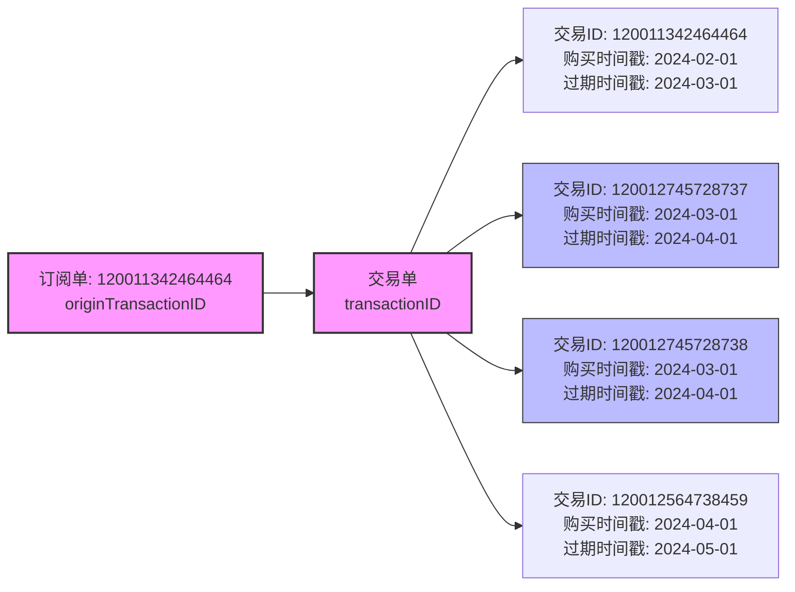
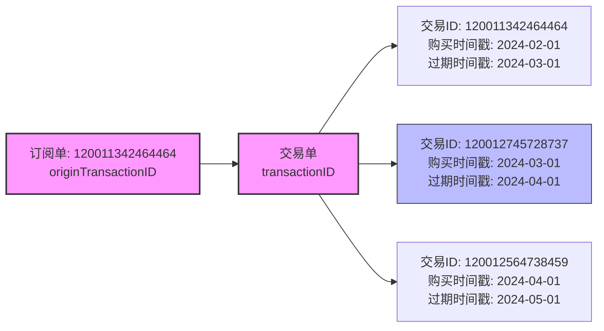
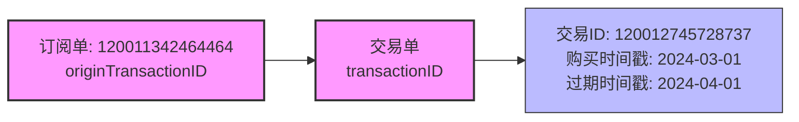
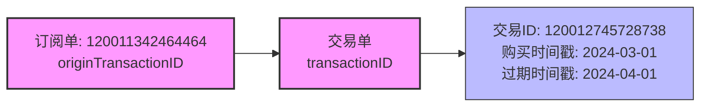
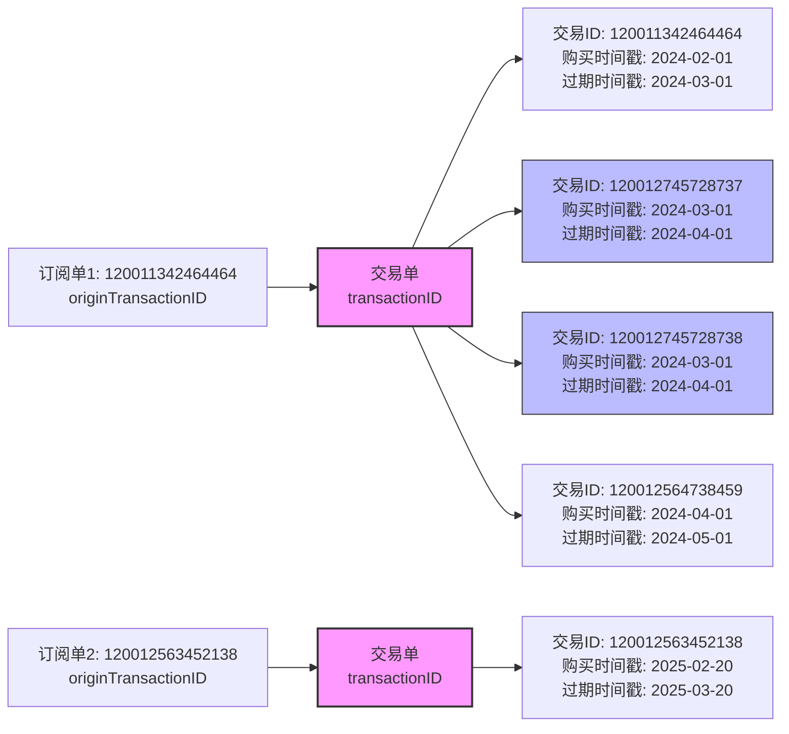
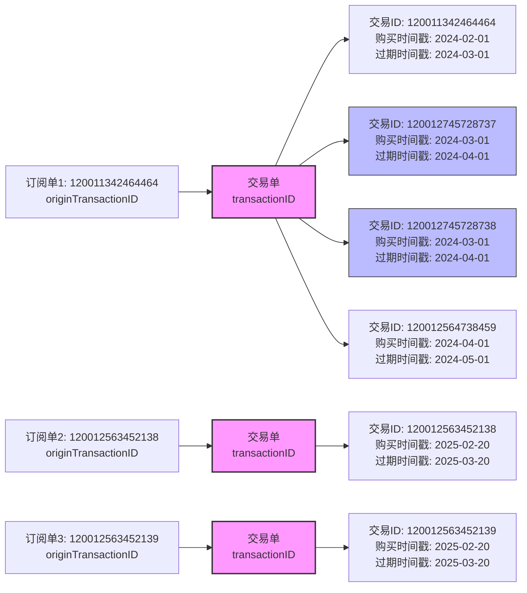

## 概念说明

开始前，我们先明确两个重要概念：

- **订阅单**：代表一个订阅组的初始交易，也是 Apple 的`originTransactionID`
- **交易单**：代表一笔实际的收费交易，也是 Apple 的`transactionID`

## Apple 交易单问题

### 一个交易单存在多个交易 ID

Apple 订阅系统中，同一笔`交易单`可能对应多个交易 ID（如 120012745728737、120012745728738），它们拥有相同的购买时间戳和过期时间戳，表明属于同一笔交易。

---

## 苹果的多个数据源，交易数据不一致

苹果提供了多种 API 来获取交易信息，但不同接口返回的数据可能存在差异，给开发者带来困扰：

### [Get Transaction History](https://developer.apple.com/documentation/appstoreserverapi/get-transaction-history)

- 接口：`https://api.storekit.itunes.apple.com/inApps/v2/history/{transactionId}`

- 参数: 120012745728737 和 120012745728738 返回结果是一样的

### [Get Transaction Info](https://developer.apple.com/documentation/appstoreserverapi/get_transaction_info)

- 接口：`https://api.storekit.itunes.apple.com/inApps/v1/transactions/{transactionId}`

- 参数: 120012745728737

- 参数: 120012745728738

### [Get All Subscription Statuses](https://developer.apple.com/documentation/appstoreserverapi/get-all-subscription-statuses)

- 接口：`https://api.storekit.itunes.apple.com/inApps/v1/subscriptions/{transactionId}`
- 特点：返回用户所有订阅的状态

- 参数: 120012745728737 和 120012745728738 返回结果是一样的

### [Look Up Order ID](https://developer.apple.com/documentation/appstoreserverapi/look-up-order-id)

- 接口：`https://api.storekit.itunes.apple.com/inApps/v1/lookup/{orderId}`
- 特点：通过订单 ID 查询交易
- 未测试, 数据未知

### [App Store Server Notifications V2](https://developer.apple.com/documentation/AppStoreServerNotifications/App-Store-Server-Notifications-V2)

- 特点：推送交易状态变化通知

### 总结

- [Get Transaction Info](https://developer.apple.com/documentation/appstoreserverapi/get_transaction_info): 对于重复的交易 id 是可以查询到数据的
- [Get All Subscription Statuses](https://developer.apple.com/documentation/appstoreserverapi/get-all-subscription-statuses) + [Get Transaction Info](https://developer.apple.com/documentation/appstoreserverapi/get_transaction_info) + [App Store Server Notifications V2](https://developer.apple.com/documentation/AppStoreServerNotifications/App-Store-Server-Notifications-V2) 都是只返回其中一个交易 ID
- `注意`: 交易 id120012745728737 和 120012745728738 相差 1, 但有时候不在 +1/-1 范围, 有可能是 +2/-2 范围, 也有可能超出这个范围......

## 同一个订阅组多个订阅单

按照最之前苹果的约定, 同一个订阅组, 只会有一个`订阅单`,但是最近发现以下一些不符合之前的逻辑

### 问题 1: 生成新的订阅单

大概在 2025 年 2, 3 月的时候, 发现苹果竟然对一些很久没有续费的`订阅单`, 生成了新的订阅单号(originTransactionID)

### 问题 2: 重复的订阅单

其中还发现存在一些重复的订阅单, 类似最开始描述的多个交易 ID 情况

### 问题 3: 新`订阅单`的回滚到旧`订阅单`

## 

`注意: 发生在2025-03-17之后, 所有的回调, 查询交易, 查询状态的返回数据, 对应交易关联全部被回滚到旧的订阅单. 你说奇不奇葩? 跟闹着玩似的`

## 苹果的订阅支付开发历程

#### 通知部分演进时间线：

- **2019-11**: App Store Server Notifications 初版发布
- **2021-10**: App Store Server Notifications V2 发布
- **2022-06**: 支持发送 TEST 通知
- **2023-06**: App Store Server Notifications V1 被废弃
- **2023-10**: JWSTransactionDecodedPayload 对象新增属性：price, currency 和 offerDiscountType
- **2024-04**: 新增 CONSUMPTION_REQUEST 通知类型，用于自动续期订阅的退款请求
- **2025-03**: JWSTransactionDecodedPayload 中新增 previousOriginalTransactionId 字段 `(就是这个最奇葩的改动)`

## Apple Developer Forums 相关 issuer

[Purchase information for users wit… | Apple Developer Forums](https://developer.apple.com/forums/thread/778493)

[original_transaction_id associated… | Apple Developer Forums](https://developer.apple.com/forums/thread/778301)

[StoreKit2 and Subscription Receipt… | Apple Developer Forums](https://developer.apple.com/forums/thread/777898)

[StoreKit.product.purchase returns … | Apple Developer Forums](https://developer.apple.com/forums/thread/777848)

[Issue with App Store Server Notifi… | Apple Developer Forums](https://developer.apple.com/forums/thread/777254)

[Behavior of the "get all subscript… | Apple Developer Forums](https://developer.apple.com/forums/thread/775216)
