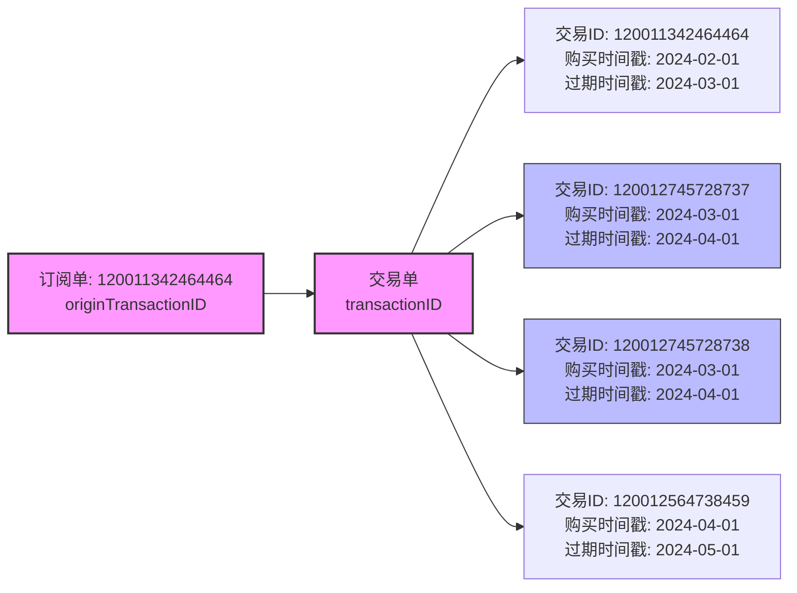
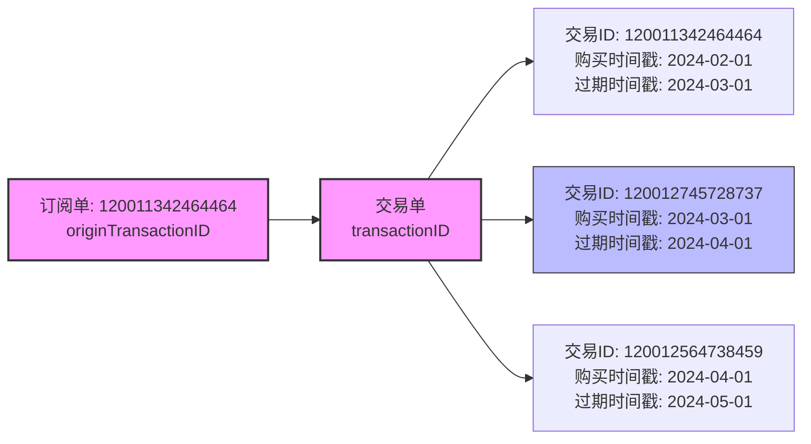
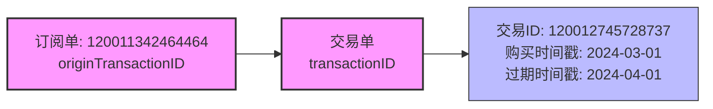
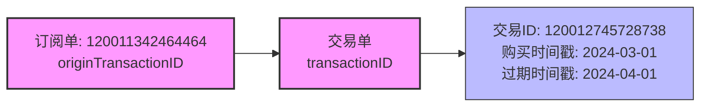
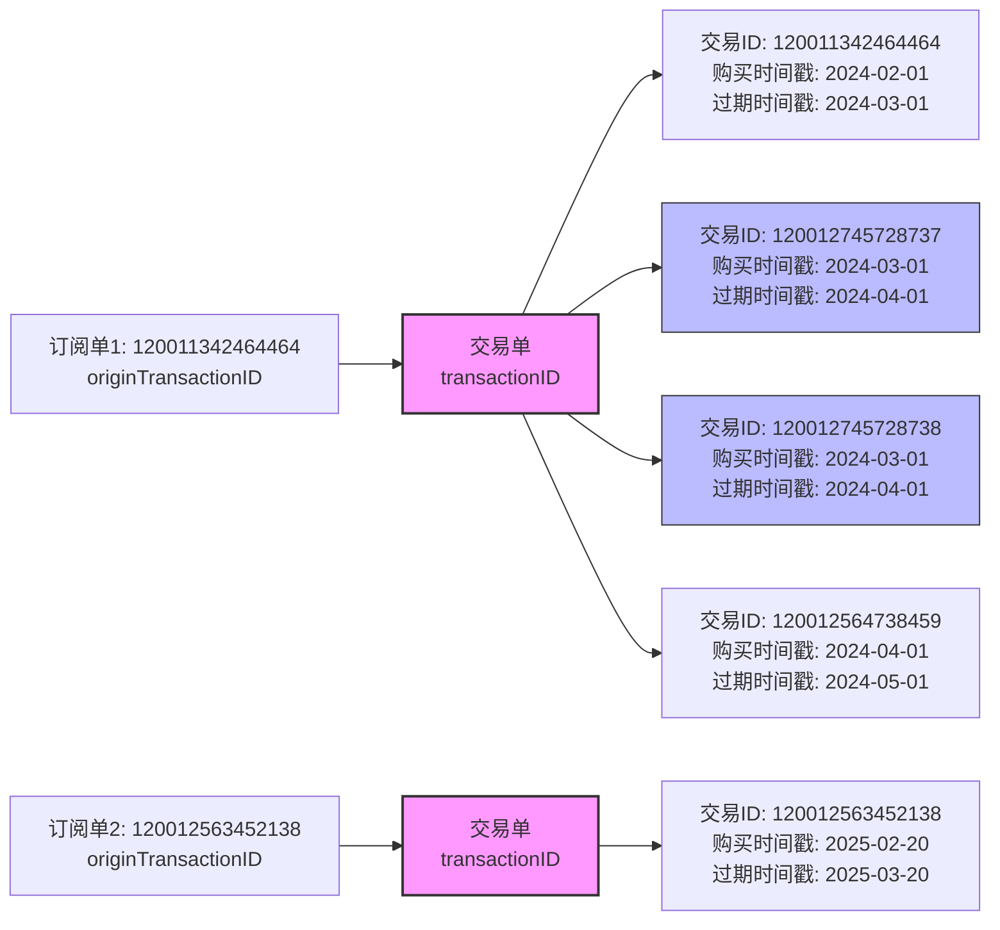
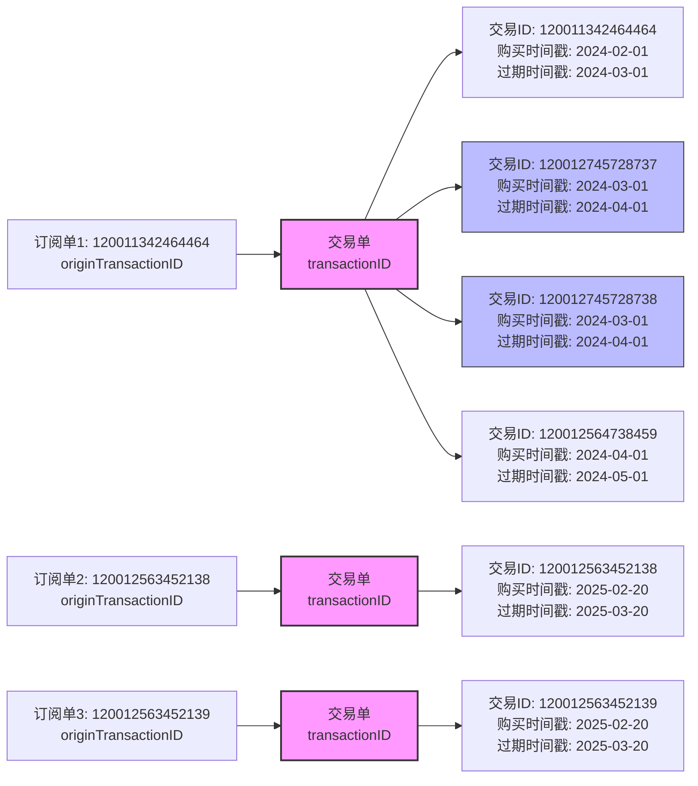

## 一、概念说明

开始前，我们先明确两个重要概念：

- **订阅单**：代表一个订阅组的初始交易，也是 Apple 的`originTransactionID`
- **交易单**：代表一笔实际的收费交易，也是 Apple 的`transactionID`

## 二、Apple 订阅系统问题

### 2.1 一个交易单存在多个交易 ID

Apple 订阅系统中，同一笔`交易单`可能对应多个交易 ID（如 120012745728737、120012745728738），它们拥有相同的购买时间戳和过期时间戳，表明属于同一笔交易。

### 2.2 多数据源数据不一致

苹果提供了多种 API 来获取交易信息，但不同接口返回的数据可能存在差异，给开发者带来困扰：

#### 2.2.1 [Get Transaction History](https://developer.apple.com/documentation/appstoreserverapi/get-transaction-history)

- 接口：`https://api.storekit.itunes.apple.com/inApps/v2/history/{transactionId}`
- 参数: 120012745728737 和 120012745728738 返回结果是一样的

#### 2.2.2 [Get Transaction Info](https://developer.apple.com/documentation/appstoreserverapi/get_transaction_info)

- 接口：`https://api.storekit.itunes.apple.com/inApps/v1/transactions/{transactionId}`
- 参数: 120012745728737

- 参数: 120012745728738

#### 2.2.3 [Get All Subscription Statuses](https://developer.apple.com/documentation/appstoreserverapi/get-all-subscription-statuses)

- 接口：`https://api.storekit.itunes.apple.com/inApps/v1/subscriptions/{transactionId}`
- 特点：返回用户所有订阅的状态
- 参数: 120012745728737 和 120012745728738 返回结果是一样的

#### 2.2.4 [Look Up Order ID](https://developer.apple.com/documentation/appstoreserverapi/look-up-order-id)

- 接口：`https://api.storekit.itunes.apple.com/inApps/v1/lookup/{orderId}`
- 特点：通过订单 ID 查询交易
- 未测试, 数据未知

#### 2.2.5 [App Store Server Notifications V2](https://developer.apple.com/documentation/AppStoreServerNotifications/App-Store-Server-Notifications-V2)

- 特点：推送交易状态变化通知

#### 2.2.6 结论

- **Get Transaction Info**: 对于重复的交易 ID 都可以查询到数据
- **Get All Subscription Statuses**、**Get Transaction Info** 和 **App Store Server Notifications V2** 都只返回其中一个交易 ID
- **注意**: 交易 ID 120012745728737 和 120012745728738 相差 1, 但有时候不在 +1/-1 范围, 有可能是 +2/-2 范围, 也有可能超出这个范围......

## 三、一个订阅组多个订阅单

按照之前苹果的约定, 同一个订阅组, 只会有一个`订阅单`，但最近出现了一些不符合以往逻辑的情况：

### 3.1 生成新的订阅单问题

大概在 2025 年 2、3 月的时候, 发现苹果竟然对一些很久没有续费的`订阅单`, 生成了新的订阅单号(originTransactionID)

### 3.2 重复的订阅单问题

其中还发现存在一些重复的订阅单, 类似最开始描述的多个交易 ID 情况

### 3.3 新订阅单回滚到旧订阅单问题

**注意**: 发生在 2025-03-17 之后，所有的回调、查询交易、查询状态的返回数据，对应交易关联全部被回滚到旧的订阅单。你说奇不奇葩? 跟闹着玩似的...

## 四、苹果订阅支付系统的演进历程

### 4.1 通知部分演进时间线

- **2019-11**: App Store Server Notifications 初版发布
- **2021-10**: App Store Server Notifications V2 发布
- **2022-06**: 支持发送 TEST 通知
- **2023-06**: App Store Server Notifications V1 被废弃
- **2023-10**: JWSTransactionDecodedPayload 对象新增属性：price, currency 和 offerDiscountType
- **2024-04**: 新增 CONSUMPTION_REQUEST 通知类型，用于自动续期订阅的退款请求
- **2025-03**: JWSTransactionDecodedPayload 中新增 previousOriginalTransactionId 字段 `(就是这个最奇葩的改动)`

## 五、问题反馈过程

### 发起 issuer

- 在 [Apple Developer Forums](https://developer.apple.com/forums) 发起 issuer
- 我提了 issuer [Transaction ID Misassociation in IAP Subscription API](https://developer.apple.com/forums/thread/777433)
- 不起作用, 一句话懒得理你, 要你提到 https://feedbackassistant.apple.com/feedback
  

### 填写 feedback

回复时间真久不说, 等来的只是几个字回复..... 就问你服不服 ? 好歹我也提供了那么多数据啊, apple 老大哥!!!
关键是这回复, 回了跟没回有什么区别?

- 问题原因是什么? --- 没说
- 怎么解决的? --- 没说
- 异常的订单怎么处理? --- 没说
- `去死吧 垃圾apple` --- 我说
  

## 六、相关官方讨论链接

[Purchase information for users wit… | Apple Developer Forums](https://developer.apple.com/forums/thread/778493)

[original_transaction_id associated… | Apple Developer Forums](https://developer.apple.com/forums/thread/778301)

[StoreKit2 and Subscription Receipt… | Apple Developer Forums](https://developer.apple.com/forums/thread/777898)

[StoreKit.product.purchase returns … | Apple Developer Forums](https://developer.apple.com/forums/thread/777848)

[Issue with App Store Server Notifi… | Apple Developer Forums](https://developer.apple.com/forums/thread/777254)

[Behavior of the "get all subscript… | Apple Developer Forums](https://developer.apple.com/forums/thread/775216)
