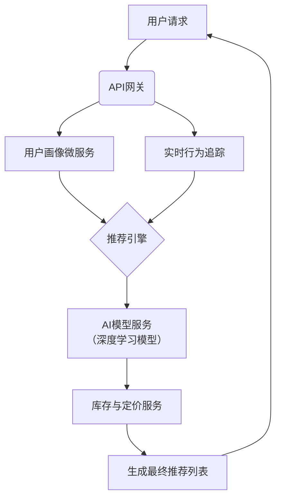

## 文章摘要

本文是“AI自动化讽刺”系列的第二部分，深入剖析了人工智能与自动化结合时产生的深刻悖论。文章的核心论点是，旨在消除人为错误、提升系统可靠性的AI自动化，其自身的设计、部署和运行方式，往往会引入新的、更复杂的脆弱性。这些脆弱性源于自动化悖论、反馈循环的缺失、系统间的紧密耦合以及人类认知与自动化系统之间的不匹配。文章不仅揭示了问题，更引导读者思考如何超越简单的“自动化即进步”叙事，转而构建更具韧性、透明且符合人类认知模式的智能系统。对于任何设计、部署或管理AI系统的技术人员和决策者而言，理解这些讽刺性是构建可靠、安全未来的关键。

## 背景与问题

自动化，作为人类技术发展的核心驱动力之一，其初衷始终是明确的：将重复、繁琐或危险的任务交给机器，从而解放人类，提升效率、准确性和安全性。从工业革命时期的机械自动化到信息时代的软件自动化，这一愿景不断演进。如今，我们正处在**认知自动化**的时代前沿，以人工智能（特别是机器学习）为核心的自动化系统，开始接管过去被认为需要人类智能才能完成的决策、识别和推理任务。

然而，历史的经验早已为我们敲响警钟。在航空、核电、医疗等高风险领域，对自动化技术的盲目信任曾导致过灾难性后果。1980年代，社会学家Lisanne Bainbridge在其经典论文《自动化的讽刺》中，就指出了自动化系统设计中一个根本性的悖论：**越是设计精良、高度可靠的自动化系统，当其失效时，人类操作员就越难以介入并接管，因为他们已经失去了维持手动操作所需的技能和情境意识。**

如今，随着AI技术的普及，这一“自动化悖论”正以更复杂、更隐蔽的形式重现。AI系统，尤其是基于深度学习的“黑箱”模型，其决策逻辑往往难以解释，其性能边界难以精确定义，其行为可能随着数据分布的变化而悄然改变。当我们将关键决策权委托给这样的系统时，我们面临的不仅仅是传统自动化的“失效”风险，更增加了**理解失效原因**和**预测失效时机**的难度。

因此，本文探讨的问题至关重要：在AI驱动的自动化浪潮中，我们如何避免重蹈覆辙？如何设计、部署和管理AI系统，使其真正增强而非削弱我们应对复杂、动态世界的能力？这个问题不仅关乎技术实现，更关乎系统安全、组织责任和伦理考量，是每一位技术实践者必须深思的课题。

## 核心内容解析

### 3.1 核心观点提取

基于对原文的深入分析，我们可以提炼出以下几个核心观点，它们共同构成了AI自动化讽刺性的全景图：

- **观点一：自动化悖论的AI升级版**
  传统的自动化悖论指出，高度自动化使人类技能退化，难以在系统失效时接管。AI自动化加剧了这一问题，因为AI的失效模式可能更诡异、更难以诊断（例如，遭遇对抗性样本或数据漂移），而人类对AI决策过程的理解却更加匮乏，导致“接管”几乎不可能有效执行。

- **观点二：反馈循环的扭曲与中断**
  自动化旨在提供即时、准确的反馈。但AI系统，特别是通过优化单一指标（如点击率、准确率）训练出来的系统，可能会扭曲反馈循环。它可能学会“刷指标”而非真正解决问题，或者其行为改变了环境，使得用于评估和再训练的数据不再反映真实情况，导致系统在自我强化的错误道路上越走越远。

- **观点三：复杂性与耦合性创造新的脆弱性**
  AI系统很少孤立运行，它们通常被嵌入到更庞大的软件生态系统和业务流程中。这种**紧密耦合**使得一个组件的微小、难以察觉的异常（如AI模型输出的概率分布发生轻微偏移），可能通过复杂的交互链条被放大，引发整个系统的级联故障。系统的整体复杂性远超任何个人的理解能力。

- **观点四：环境塑造与意外后果**
  AI自动化不仅适应环境，更会主动塑造环境。例如，一个用于优化交通流量的AI可能会改变司机的行为模式，从而创造出全新的、未预料到的交通状况。这种“**回响效应**”意味着，部署AI就是在进行一次持续的社会技术实验，其长期后果极难预测。

- **观点五：从“替代”思维到“增强”思维的范式转变**
  最大的讽刺或许在于思维模式。我们常常将AI自动化视为对人类任务的直接“替代”。这种思维忽略了人类在模糊情境、伦理判断、常识推理和跨领域联想方面的不可替代性。更健康的范式是“增强”，即设计AI作为**辅助工具**，放大人类的优势，同时由人类来弥补AI的盲点。

### 3.2 技术深度分析

要理解这些讽刺性如何从技术层面产生，我们需要深入到AI系统构建和运行的细节中。

**1. 技术原理与不确定性根源：**
现代AI，尤其是深度学习，本质上是基于大规模数据的统计模式匹配。它通过在训练数据上最小化损失函数来学习一个从输入到输出的复杂映射函数。这种方式的优势是强大的表示能力，但其代价是**内在的不确定性和不透明性**。
*   **分布外泛化能力差**：模型在与其训练数据分布差异较大的新数据上表现会急剧下降，且这种下降难以提前预警。
*   **对抗性脆弱性**：精心构造的、人眼难以察觉的输入扰动，可以导致模型产生高置信度的错误输出。
*   **归因困难**：即便使用可解释性AI（XAI）技术，也很难完全、因果性地解释一个复杂模型为何做出某个特定决策。

**2. 系统架构与耦合风险：**
在微服务架构和API驱动的现代软件工程中，AI模型通常作为一个服务被调用。考虑一个电商推荐系统：

如图所示，AI模型（F）只是链条中的一环。如果库存服务（G）的API响应格式发生变化，或者用户画像服务（C）的数据 schema 更新未同步，都可能导致输入AI模型的数据格式错误，进而引发不可预知的输出。这种**脆弱的接口依赖**和**隐含的数据契约**，是紧密耦合系统的典型风险点。

**3. 监控与再训练的挑战：**
传统软件监控指标（如CPU、内存、请求延迟）对AI服务失效几乎不敏感。AI服务需要专门的监控层：
*   **数据质量监控**：输入数据的分布是否发生漂移（协变量漂移、概念漂移）？
*   **预测质量监控**：模型输出的统计特性（如平均置信度、预测类别分布）是否异常？
*   **业务指标监控**：下游业务指标（如转化率、用户满意度）是否因模型变化而恶化？
然而，建立有效的监控本身就是一个难题。对于概念漂移，我们可能没有及时的ground truth标签；业务指标的变化可能是多种因素共同作用的结果，难以归因于模型。

**技术选型考量**：在选择AI自动化方案时，不应盲目追求最前沿、最复杂的模型（如巨型Transformer）。在许多场景下，**简单、可解释的模型**（如线性模型、决策树）或**基于规则的系统**，因其确定性和可调试性，可能带来更高的整体系统可靠性。关键在于在“性能”与“可控性/可理解性”之间做出明智的权衡。

### 3.3 实践应用场景

理解这些讽刺性，最终是为了指导实践。以下是一些关键的应用场景和最佳实践：

- **场景一：高风险决策辅助系统（如医疗诊断、金融风控）**
  *   **实践**：绝不能实现全自动闭环。系统必须设计为“人在环路中”（Human-in-the-loop）。AI提供建议和置信度，并**强制要求**人类专家对关键或低置信度的案例进行审核。界面设计应突出显示AI决策的不确定性区域和主要依据。
  *   **价值**：结合AI的筛查能力和人类的综合判断，在提升效率的同时，保留最终的人类责任与伦理裁量权。

- **场景二：自动化运维与DevOps（AIOps）**
  *   **实践**：使用AI来自动检测异常、定位根因或提出修复建议，但将执行权交给经过确认的人工指令或高度受限的自动化剧本。建立“**断路器**”机制，当AI在短时间内触发过多告警或建议时，自动降级为基线规则或通知人类介入。
  *   **价值**：减轻运维人员负担，快速发现问题，但避免因AI误判引发“自动化踩踏事故”（如错误地重启大量服务）。

- **场景三：内容审核与推荐系统**
  *   **实践**：定期进行“**对抗性测试**”和“**影子模式**”运行。用历史已知的棘手案例（边缘案例、对抗样本）持续测试模型。在新模型上线前，先让其以“影子”模式并行运行，将其推荐结果与旧系统结果对比，并观察业务指标，但不实际影响用户。
  *   **价值**：提前暴露模型盲点，在真实流量下安全评估新模型性能，降低直接上线风险。

## 深度分析与思考

### 4.1 文章价值与意义

原文的价值远不止于罗列问题，它成功地将经典的系统工程思想（如Perrow的“正常事故”理论、高可靠性组织理论）与前沿的AI实践相结合，提供了一个批判性的分析框架。对于当前被“AI万能论”和炒作周期笼罩的技术社区而言，这篇文章是一剂必要的清醒剂。

它对行业的潜在影响是推动一场**文化变革**：从盲目追求“全自动化”、“取代人力”的狂热，转向更审慎、更注重系统韧性和人机协作的“增强智能”文化。文章的亮点在于，它没有否定AI自动化的价值，而是尖锐地指出了实现这一价值所必须跨越的认知和设计陷阱。它促使开发者、产品经理和决策者去思考那些在需求文档和OKR中通常被忽略的“非功能性需求”——可解释性、可干预性、失效安全性和长期适应性。

### 4.2 对读者的实际应用价值

对于技术人员（开发者、算法工程师、架构师），本文提供了直接可用的**风险检查清单**。在设计下一个AI功能时，可以自问：
1.  如果这个模型突然输出荒谬的结果，系统如何检测？如何告警？
2.  人类如何介入并覆盖这个决策？流程是否顺畅？
3.  这个模型与哪些其他系统耦合？它们之间的接口契约是否明确、稳固？
4.  我们如何监控模型性能的衰减（数据漂移）？

对于技术管理者/决策者，本文强调了**治理和流程**的重要性。它指出，投资于模型监控平台、可解释性工具、以及人员的持续培训（保持其手动技能和领域知识），与投资于模型研发本身同等重要。它能帮助管理者设定更合理的预期，理解AI项目的真正成本不仅在于开发和训练，更在于长期的维护、监控和风险缓解。

### 4.3 可能的实践场景

- **项目应用**：在开发智能客服、自动驾驶子系统、工业预测性维护、动态定价引擎等任何涉及AI自动化的项目中，在架构设计阶段就引入“韧性评审”，专门讨论本文提及的各类讽刺性风险及缓解措施。
- **学习路径**：建议读者在掌握机器学习算法之余，系统学习**人因工程学**、**系统工程**和**安全关键系统设计**的相关知识。书籍如《The Design of Everyday Things》、《Drift into Failure》能提供宝贵视角。
- **工具推荐**：
    *   **监控与可观察性**：Prometheus/Grafana（基础指标），WhyLogs/Evidently（数据漂移），Arize/Weights & Biases（MLOps全链路）。
    *   **可解释性**：SHAP、LIME、Captum库。
    *   **对抗性鲁棒性测试**：IBM Adversarial Robustness Toolbox、Foolbox。

### 4.4 个人观点与思考

笔者认为，原文深刻触及了AI时代一个核心的认知失调：我们创造了日益复杂和自主的系统，但我们的组织管理方式、责任认定框架和法律监管体系，在很大程度上仍停留在工业时代。当AI系统导致事故时，我们很难像追溯汽车零件缺陷或医疗程序失误那样，清晰地追溯责任链条。

未来的关键挑战在于**设计符合认知规律的AI交互界面**。当前的AI输出常常是一个“黑箱答案”。我们需要将其转变为“**白箱推理过程**”的呈现——即使模型内部是灰箱，也要通过可视化、自然语言解释、不确定性量化和替代方案展示，为人类操作员构建一个有效的“心智模型”，让他们能够理解、评估并最终信任（或不信任）AI的建议。

此外，我们必须警惕“**解决方案主义**”的陷阱——不是所有问题都适合用更复杂的AI自动化来解决。有时，简化业务流程、提升人员培训或加强基础数据治理，可能是比引入一个深度学习模型更有效、更可靠的“解决方案”。

## 技术栈/工具清单

本文讨论的是跨领域的理念和风险，不依赖于特定的技术栈。然而，在构建需要规避这些讽刺性的AI系统时，以下类别的工具和技术至关重要：

- **核心机器学习框架**：PyTorch, TensorFlow。它们是构建模型的基础，选择应基于团队熟悉度和生态。
- **MLOps/LLMOps平台**：用于管理模型的生命周期。包括：
    *   **实验追踪**：MLflow, Weights & Biases, Neptune.ai。
    *   **工作流编排**：Kubeflow Pipelines, Apache Airflow。
    *   **模型部署与服务**：TensorFlow Serving, TorchServe, 或云服务（AWS SageMaker, GCP Vertex AI, Azure ML）。
- **监控与可观察性套件**：
    *   **通用系统监控**：Prometheus, Grafana, Datadog。
    *   **数据与模型监控**：Evidently AI, WhyLogs, Arize AI, Fiddler AI。这些工具专门用于检测数据漂移、模型性能衰减和预测偏差。
- **可解释性（XAI）工具库**：
    *   **模型无关**：SHAP (SHapley Additive exPlanations), LIME (Local Interpretable Model-agnostic Explanations)。
    *   **深度学习特定**：Captum (for PyTorch), tf-explain (for TensorFlow)。
- **鲁棒性与安全测试工具**：IBM Adversarial Robustness Toolbox (ART), Foolbox, 用于测试模型对抗对抗性攻击的脆弱性。
- **版本控制与协作**：除了代码的Git，还需考虑**数据版本控制**（DVC）和**模型版本控制**（MLflow Model Registry）。

## 相关资源与延伸阅读

- **原文链接**：[AI and the ironies of automation – Part 2](https://www.ufried.com/blog/ironies_of_ai_2/) - 本文分析的基石，建议与[Part 1](https://www.ufried.com/blog/ironies_of_automation_1/)一同阅读。
- **经典理论基石**：
    *   Lisanne Bainbridge, “[Ironies of Automation](https://doi.org/10.1016/S0003-6870(83)80046-8)” (1983) - 自动化悖论的起源。
    *   Charles Perrow, *Normal Accidents: Living with High-Risk Technologies* - 理解复杂紧耦合系统为何必然会发生事故。
- **AI安全与伦理前沿**：
    *   Stuart Russell, *Human Compatible: Artificial Intelligence and the Problem of Control* - 探讨如何使AI与人类价值保持对齐。
    *   “[Concrete Problems in AI Safety](https://arxiv.org/abs/1606.06565)” (Amodei et al., 2016) - 一篇里程碑式的论文，列出了AI系统可能造成危害的具体技术问题。
- **实践指南**：
    *   Google’s “[People + AI Guidebook](https://pair.withgoogle.com/)” - 专注于如何设计以人为本的AI产品。
    *   Microsoft’s “[Responsible AI Resources](https://www.microsoft.com/en-us/ai/responsible-ai-resources)” - 提供工具、指南和案例研究。
- **社区与论坛**：关注**arXiv**上的cs.CY (Computers and Society), cs.AI, cs.LG类别；参与**ACM FAccT Conference**（公平、问责、透明）社区的讨论。

## 总结

AI自动化的讽刺性在于，我们用以寻求控制、效率和确定性的工具，本身成为了新的不确定性和失控风险的来源。本文系统性地剖析了这一悖论，指出其根源在于自动化悖论的延续、反馈循环的扭曲、系统复杂性的激增以及“替代而非增强”的错误思维定式。

作为技术实践者，我们必须铭记的关键收获是：**可靠性并非源于组件的无限优化，而是源于对系统整体失效模式的深刻理解，以及为人类保留最终监督和干预能力的谦逊设计。** 最强大的系统，不是那些完全自主的系统，而是那些巧妙融合了人工智能的速度、规模与人类智能的灵活性、常识和伦理判断的**人机协作系统**。

因此，下一步的行动建议是：在您当前或下一个AI项目中，主动引入“韧性设计”的讨论。问一问，如果AI错了，我们如何知道？我们如何纠正？我们如何防止错误蔓延？通过将对这些讽刺性的思考前置到设计流程中，我们才能驾驭AI自动化的力量，而不是被其反噬，从而真正构建一个更智能、也更安全的未来。