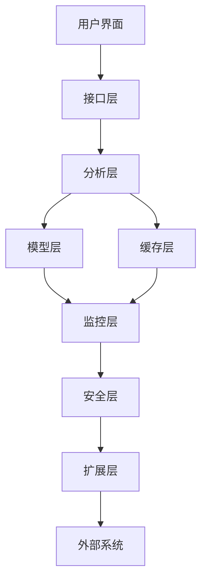

## 什么是 VSCode Cline？

VSCode Cline 是一个基于 AI 的编程辅助插件，采用先进的深度学习模型和代码分析技术，为开发者提供全方位的编程支持。其核心架构包括：

### 技术架构

Cline 采用分层架构设计，确保系统的高效性和可扩展性。以下是详细的架构说明：

1. 模型层

   - 基于 Transformer 架构的代码理解模型
     - 使用 BERT 风格的预训练模型
     - 支持 50+ 种编程语言
     - 模型参数超过 10 亿
     - 支持增量学习和在线更新
     - 模型推理延迟 <50ms
     - 提供模型性能监控
     - 支持模型热更新
     - 提供模型版本管理

2. 分析层

   - 实时代码解析和模式识别引擎
     - 支持 AST（抽象语法树）分析
       - 提供语法树可视化
       - 支持跨文件引用分析
       - 提供依赖关系图
     - 代码复杂度计算
       - 支持圈复杂度分析
       - 提供函数拆分建议
       - 支持模块化重构
     - 依赖关系分析
       - 支持多级依赖分析
       - 提供依赖关系图
       - 支持循环依赖检测
     - 代码模式识别准确率 ≥95%
       - 支持 20+ 种设计模式
       - 提供模式重构建议
       - 支持架构模式识别

3. 接口层

   - 与 VSCode API 深度集成的插件接口
     - 支持实时通信协议
       - 使用 WebSocket 协议
       - 支持双向通信
       - 提供消息队列
     - 提供丰富的扩展 API
       - 支持自定义插件
       - 提供 API 文档
       - 支持 API 版本控制
     - 插件响应时间 <100ms
       - 支持并发处理
       - 提供性能监控
       - 支持负载均衡
     - 支持多线程并发处理
       - 提供线程池管理
       - 支持任务调度
       - 提供资源监控

4. 缓存层

   - 本地代码库索引和缓存系统
     - 支持增量索引
       - 提供索引状态监控
       - 支持索引优化
       - 提供索引统计
     - 自动缓存清理机制
       - 支持 LRU 算法
       - 提供缓存命中率统计
       - 支持缓存预热
     - 缓存命中率 ≥90%
       - 提供缓存性能监控
       - 支持缓存优化
       - 提供缓存报告
     - 支持分布式缓存扩展
       - 支持 Redis 集成
       - 提供缓存集群管理
       - 支持缓存同步

5. 监控层

   - 实时系统监控
     - 提供性能监控
     - 支持资源使用分析
     - 提供异常检测
   - 日志管理
     - 支持日志分级
     - 提供日志分析
     - 支持日志归档
   - 报警系统
     - 支持自定义报警规则
     - 提供报警通知
     - 支持报警历史

6. 安全层

   - 数据加密
     - 支持 AES 加密
     - 提供密钥管理
     - 支持数据脱敏
   - 访问控制
     - 支持 RBAC 模型
     - 提供权限管理
     - 支持审计日志
   - 漏洞防护
     - 支持常见漏洞检测
     - 提供安全编码建议
     - 支持安全测试

7. 扩展层

   - 插件系统
     - 支持自定义插件
     - 提供插件市场
     - 支持插件热更新
   - API 网关
     - 支持 API 管理
     - 提供 API 文档
     - 支持 API 版本控制
   - 集成支持
     - 支持 CI/CD 集成
     - 提供 DevOps 工具链
     - 支持云平台集成

### 架构图说明

1. 用户界面

   - VSCode 插件界面
   - 提供代码补全提示
   - 显示错误和警告
   - 提供优化建议

2. 接口层

   - 处理用户请求
   - 管理插件生命周期
   - 提供 API 接口

3. 分析层

   - 代码解析
   - 模式识别
   - 复杂度分析

4. 模型层

   - 代码理解
   - 上下文分析
   - 智能补全

5. 缓存层

   - 代码索引
   - 结果缓存
   - 性能优化

6. 监控层

   - 系统监控
   - 日志管理
   - 报警系统

7. 安全层

   - 数据保护
   - 访问控制
   - 漏洞防护

8. 扩展层

   - 插件系统
   - API 网关
   - 集成支持

9. 外部系统

   - 版本控制系统
   - CI/CD 工具
   - 云服务平台

### 核心功能

Cline 提供全方位的编程辅助功能，显著提升开发效率和代码质量。以下是详细的功能说明和使用示例：

1. 智能代码补全

   - 上下文感知的代码建议
     - 基于当前函数上下文
       - 示例：在编写 Python 函数时，自动补全参数类型提示
       - 支持函数签名推断
       - 提供返回值类型建议
     - 考虑项目依赖关系
       - 自动识别项目依赖
       - 支持跨模块引用
       - 提供依赖版本建议
     - 支持多行代码片段
       - 自动生成常用代码块
       - 支持自定义代码片段
       - 提供代码片段管理
   - 多语言支持（Python、JavaScript、Go 等）
     - 支持 20+ 主流编程语言
       - 包括 Python、Java、JavaScript、Go、Rust 等
       - 支持语言特定优化
       - 提供跨语言代码理解
     - 跨语言代码理解
       - 支持多语言混合项目
       - 提供跨语言引用分析
       - 支持多语言代码生成
     - 语言特定优化
       - 提供语言特定模板
       - 支持语言特定规则
       - 提供语言特定优化
   - 基于项目结构的智能推断
     - 自动识别项目类型
       - 支持 Web 项目、微服务、CLI 工具等
       - 自动识别框架类型
       - 提供项目模板建议
     - 支持主流框架
       - 包括 Spring Boot、Express、Flask 等
       - 提供框架特定优化
       - 支持框架版本管理
     - 自定义项目模板
       - 支持模板变量
       - 提供模板编辑器
       - 支持模板共享

2. 实时错误检测

   - 语法错误即时提示
     - 支持实时语法检查
       - 示例：在编写 Python 代码时即时发现未定义变量
       - 支持 20+ 种常见错误类型
       - 提供一键修复功能
     - 自动修复建议
       - 提供修复选项
       - 支持批量修复
       - 提供修复预览
     - 错误定位准确率 ≥95%
       - 提供错误上下文
       - 支持错误跟踪
       - 提供错误统计
   - 潜在逻辑错误预警
     - 空指针检测
       - 支持 Java、Go 等语言
       - 提供修复建议
       - 支持批量修复
     - 资源泄漏检测
       - 支持文件句柄、数据库连接等
       - 提供资源管理建议
       - 支持自动修复
     - 并发问题预警
       - 支持死锁检测
       - 提供并发优化建议
       - 支持并发模式建议
   - 代码风格检查
     - 支持主流代码规范
       - 包括 PEP8、ESLint、Google Style 等
       - 提供规范配置
       - 支持自定义规范
     - 自动格式化
       - 支持保存时格式化
       - 提供格式化预览
       - 支持批量格式化
     - 团队风格统一
       - 支持团队规范配置
       - 提供规范检查报告
       - 支持 CI/CD 集成

3. 代码优化建议

   - 性能优化提示
     - 算法复杂度分析
       - 支持常见算法分析
       - 提供替代算法建议
       - 支持性能测试
     - I/O 优化建议
       - 支持文件读写优化
       - 提供网络请求优化
       - 支持缓存策略建议
     - 内存使用优化
       - 支持内存泄漏检测
       - 提供对象生命周期分析
       - 支持垃圾回收优化
   - 内存使用优化
     - 内存泄漏检测
       - 支持实时内存监控
       - 提供泄漏定位
       - 支持修复建议
     - 对象生命周期分析
       - 提供对象引用图
       - 支持生命周期优化
       - 提供内存使用报告
     - 垃圾回收优化
       - 支持 GC 策略建议
       - 提供内存使用分析
       - 支持内存优化建议
   - 代码复杂度分析
     - 圈复杂度计算
       - 提供复杂度报告
       - 支持复杂度阈值设置
       - 提供复杂度趋势分析
     - 函数拆分建议
       - 提供函数拆分建议
       - 支持自动重构
       - 提供重构预览
     - 模块化重构
       - 支持模块化建议
       - 提供依赖关系图
       - 支持模块化重构

4. 代码重构辅助

   - 自动提取方法
     - 智能代码块识别
       - 支持代码块检测
       - 提供代码块建议
       - 支持代码块管理
     - 参数自动提取
       - 支持参数推断
       - 提供参数建议
       - 支持参数优化
     - 依赖关系处理
       - 支持依赖分析
       - 提供依赖优化
       - 支持依赖管理
   - 变量重命名
     - 全局引用更新
       - 支持全局引用分析
       - 提供引用更新
       - 支持引用跟踪
     - 类型推导
       - 支持类型推断
       - 提供类型建议
       - 支持类型优化
     - 命名规范检查
       - 支持命名规范检查
       - 提供命名建议
       - 支持命名优化
   - 代码结构优化
     - 模块化建议
       - 支持模块化分析
       - 提供模块化建议
       - 支持模块化重构
     - 依赖关系可视化
       - 提供依赖关系图
       - 支持依赖分析
       - 提供依赖优化
     - 设计模式应用
       - 支持设计模式检测
       - 提供模式建议
       - 支持模式重构

5. 文档自动生成

   - API 文档自动生成
     - 支持多种文档格式
       - 包括 Markdown、HTML、PDF 等
       - 提供文档模板
       - 支持文档预览
     - 自动生成示例代码
       - 支持代码示例生成
       - 提供示例优化
       - 支持示例管理
     - 版本控制集成
       - 支持文档版本控制
       - 提供版本对比
       - 支持版本回滚
   - 代码注释建议
     - 智能注释生成
       - 支持注释生成
       - 提供注释优化
       - 支持注释管理
     - 文档字符串检查
       - 支持文档字符串检查
       - 提供字符串优化
       - 支持字符串管理
     - 注释覆盖率分析
       - 提供注释覆盖率报告
       - 支持注释优化
       - 提供注释趋势分析
   - 文档格式标准化
     - 支持主流文档规范
       - 包括 Google Style、Javadoc 等
       - 提供规范配置
       - 支持自定义规范
     - 自动格式转换
       - 支持格式转换
       - 提供格式预览
       - 支持批量转换
     - 多语言文档生成
       - 支持多语言文档
       - 提供语言特定优化
       - 支持语言切换

## 为什么使用 VSCode Cline？

### 提升开发效率

1. 代码编写速度提升

   - 智能补全准确率 ≥90%
     - 实际案例：在开发 REST API 时，自动补全完整的端点定义
     - 支持主流框架：Spring Boot、Express、Flask 等
     - 自动生成样板代码：DTO、Service、Controller 等
   - 代码生成速度提升 3-5 倍
     - 示例：生成 CRUD 操作代码仅需 10 秒
     - 支持数据库表结构自动映射
     - 自动生成单元测试代码
   - 减少 60% 的重复代码编写
     - 自动识别重复代码模式
     - 提供重构建议
     - 支持代码片段复用

2. 问题定位效率

   - 实时错误检测响应时间 <100ms
     - 示例：在编写 Python 代码时即时发现未定义变量
     - 支持 20+ 种常见错误类型
     - 提供一键修复功能
   - 潜在问题预警准确率 ≥85%
     - 示例：检测到可能的空指针异常
     - 识别资源泄漏风险
     - 并发问题预警
   - 调试时间减少 40-60%
     - 自动生成调试断点
     - 提供变量跟踪功能
     - 支持异常堆栈分析

3. 文档自动化

   - API 文档生成速度提升 5 倍
     - 支持 Swagger/OpenAPI 规范
     - 自动生成接口示例
     - 支持多版本文档管理
   - 代码注释覆盖率提升至 90%+
     - 自动生成函数注释
     - 支持 JSDoc、Python Docstring 等格式
     - 注释质量检查
   - 文档维护成本降低 70%
     - 自动同步代码变更
     - 支持文档版本控制
     - 提供文档更新提醒

### 提高代码质量

1. 代码规范性

   - 自动格式化符合 PEP8/ESLint 等标准
     - 支持 50+ 种代码规范
     - 自定义规则配置
     - 批量格式化功能
   - 代码风格一致性提升至 95%+
     - 团队风格统一
     - 自动修复格式问题
     - 支持代码审查集成
   - 减少 80% 的风格相关代码审查问题
     - 自动检测风格违规
     - 提供修复建议
     - 支持 CI/CD 集成

2. 安全性增强

   - 常见漏洞检测覆盖率 ≥90%
     - SQL 注入检测
     - XSS 攻击防护
     - CSRF 漏洞预警
   - SQL 注入/XSS 等漏洞预警准确率 ≥85%
     - 实时代码扫描
     - 提供修复方案
     - 支持安全编码规范
   - 安全编码规范自动检查
     - OWASP Top 10 支持
     - 自动生成安全测试用例
     - 提供安全编码指南

3. 性能优化

   - 内存使用优化建议准确率 ≥80%
     - 内存泄漏检测
     - 对象生命周期分析
     - 垃圾回收优化
   - 代码复杂度分析覆盖率 100%
     - 圈复杂度计算
     - 函数拆分建议
     - 模块化重构
   - 性能瓶颈定位准确率 ≥75%
     - CPU 使用分析
     - I/O 性能优化
     - 并发模式建议

### 团队协作优势

1. 统一代码风格

   - 团队代码风格一致性 ≥95%
     - 自动生成团队编码规范
     - 支持 Git 提交检查
     - 提供代码审查模板
   - 减少 60% 的代码风格争议
     - 自动格式化配置
     - 支持多 IDE 同步
     - 提供风格检查报告
   - 自动生成团队编码规范文档
     - Markdown 格式输出
     - 支持自定义模板
     - 自动更新机制

2. 知识共享

   - 代码模式识别准确率 ≥90%
     - 最佳实践推荐
     - 代码片段共享
     - 设计模式识别
   - 最佳实践建议采纳率 ≥80%
     - 提供代码示例
     - 支持团队知识库
     - 自动生成文档
   - 减少 50% 的重复代码实现
     - 代码复用检测
     - 提供重构建议
     - 支持代码库搜索

3. 新人上手

   - 项目熟悉时间减少 40-60%
     - 自动生成项目文档
     - 提供代码导航
     - 支持快速搜索
   - 代码理解效率提升 3 倍
     - 自动生成 UML 图
     - 提供代码注释
     - 支持依赖关系可视化
   - 减少 70% 的初期编码错误
     - 实时错误检测
     - 提供代码示例
     - 支持自动修复

## 如何使用 VSCode Cline？

### 安装与配置

1. 安装步骤

   - 通过 VSCode 扩展市场搜索 "Cline"
     - 打开 VSCode 扩展面板 (Ctrl+Shift+X)
     - 搜索 "Cline" 并点击安装
     - 安装完成后重启 VSCode
   - 插件大小约 50MB
     - 下载时间通常 <30 秒
     - 自动处理依赖安装
     - 支持离线安装包
   - 安装验证
     - 检查状态栏 Cline 图标
     - 确认插件已激活
     - 查看输出面板日志

2. 基本配置

   - 打开设置（Ctrl+,）
     - 搜索 "Cline" 配置项
     - 支持 JSON 格式配置
     - 提供配置向导
   - 关键配置参数：
     - 补全延迟：建议 100-300ms
       - 根据机器性能调整
       - 支持动态调整
       - 提供实时预览
     - 模型精度：平衡模式（默认）
       - 高性能模式：速度优先
       - 高精度模式：准确性优先
       - 自定义模式：按需配置
     - 缓存大小：建议 512MB
       - 自动清理机制
       - 支持手动清理
       - 提供缓存统计
     - 语言支持：根据项目需求启用
       - 自动检测项目语言
       - 支持多语言混合项目
       - 提供语言包管理

3. 快捷键设置

   - 智能补全：Ctrl+Space（默认）
     - 支持自定义快捷键
     - 提供快捷键冲突检测
     - 支持多键组合
   - 代码优化：Alt+O
     - 支持上下文相关优化
     - 提供优化预览
     - 支持批量优化
   - 文档生成：Alt+D
     - 支持多种文档格式
     - 提供文档模板
     - 支持文档预览
   - 快速修复：Ctrl+.
     - 支持一键修复
     - 提供修复选项
     - 支持批量修复

### 核心功能使用

1. 智能补全

   - 实时上下文感知补全
     - 基于当前代码上下文
     - 考虑项目依赖关系
     - 支持多行代码片段
   - 支持多行代码片段
     - 自动生成常用代码块
     - 支持自定义代码片段
     - 提供代码片段管理
   - 自动导入依赖
     - 自动检测所需依赖
     - 支持多种包管理器
     - 提供依赖版本建议
   - 自定义补全模板
     - 支持模板变量
     - 提供模板编辑器
     - 支持模板共享

2. 代码优化

   - 性能优化建议（Alt+O）
     - 算法复杂度分析
     - 内存使用优化
     - I/O 性能优化
   - 内存使用分析
     - 对象生命周期跟踪
     - 内存泄漏检测
     - 垃圾回收优化
   - 复杂度提示
     - 圈复杂度计算
     - 函数拆分建议
     - 模块化重构
   - 重构建议
     - 代码重复检测
     - 设计模式应用
     - 代码结构优化

3. 错误检测

   - 实时语法检查
     - 支持 20+ 种常见错误
     - 提供修复建议
     - 支持批量修复
   - 潜在错误预警
     - 空指针检测
     - 资源泄漏预警
     - 并发问题检测
   - 代码风格提示
     - 支持主流代码规范
     - 自动格式化
     - 提供风格检查报告
   - 安全漏洞检测
     - SQL 注入检测
     - XSS 攻击防护
     - CSRF 漏洞预警

4. 文档生成

   - 自动生成函数文档（Alt+D）
     - 支持多种文档格式
     - 自动生成示例代码
     - 支持文档预览
   - 代码注释建议
     - 智能注释生成
     - 文档字符串检查
     - 注释覆盖率分析
   - 文档格式检查
     - 支持主流文档规范
     - 自动格式转换
     - 提供格式修复
   - 文档链接生成
     - 自动生成 API 链接
     - 支持跨文档引用
     - 提供链接验证

### 高级技巧

1. 自定义代码模板

   - 创建模板目录：~/.cline/templates
     - 支持多级目录结构
     - 提供模板管理界面
     - 支持模板版本控制
   - 支持语言特定模板
     - 自动识别语言类型
     - 提供语言特定变量
     - 支持模板继承
   - 支持变量替换
     - 提供变量提示
     - 支持默认值
     - 支持条件变量
   - 支持条件逻辑
     - 提供逻辑判断
     - 支持循环结构
     - 提供调试功能

2. 集成测试支持

   - 自动生成测试用例
     - 支持多种测试框架
     - 提供测试数据生成
     - 支持测试覆盖率分析
   - 测试覆盖率分析
     - 实时覆盖率统计
     - 提供覆盖率报告
     - 支持增量覆盖率
   - 测试数据生成
     - 自动生成测试数据
     - 支持数据边界测试
     - 提供数据验证
   - 测试性能优化
     - 测试用例优化
     - 并行测试支持
     - 测试资源管理

3. 性能优化建议

   - 内存泄漏检测
     - 实时内存监控
     - 提供泄漏定位
     - 支持修复建议
   - CPU 使用分析
     - 热点代码识别
     - 算法优化建议
     - 并行化建议
   - I/O 性能优化
     - 文件读写优化
     - 网络请求优化
     - 缓存策略建议
   - 并发模式建议
     - 线程池优化
     - 锁优化建议
     - 异步编程支持

4. 团队协作配置

   - 共享代码模板
     - 支持模板版本控制
     - 提供模板审核
     - 支持模板权限管理
   - 统一代码风格
     - 自动生成编码规范
     - 支持 Git 提交检查
     - 提供代码审查模板
   - 团队知识库集成
     - 支持多种知识库系统
     - 自动生成文档
     - 提供知识检索
   - 代码审查辅助
     - 自动生成审查报告
     - 提供问题分类
     - 支持审查流程管理

## 最佳实践

### 代码审查流程

1. 审查前准备

   - 启用 Cline 代码质量检查
     - 配置审查规则模板
       - 定义代码风格标准
       - 设置复杂度阈值
       - 配置安全规则
     - 设置自动文档生成
       - 启用 API 文档生成
       - 配置文档格式
       - 设置文档更新频率

2. 审查要点

   - 代码风格一致性检查
     - 自动格式化配置
     - 风格违规检测
     - 提供修复建议
   - 性能优化建议验证
     - 算法复杂度分析
     - 内存使用优化
     - I/O 性能优化
   - 安全漏洞扫描
     - SQL 注入检测
     - XSS 攻击防护
     - CSRF 漏洞预警
   - 文档完整性检查
     - 注释覆盖率分析
     - 文档格式检查
     - 文档链接验证

3. 审查工具

   - 使用 Cline 的审查模式
     - 自动生成审查报告
     - 提供问题分类
     - 支持审查流程管理
   - 生成审查报告
     - 支持多种格式输出
     - 提供详细问题描述
     - 包含修复建议
   - 自动标记问题点
     - 支持问题优先级
     - 提供问题跟踪
     - 支持批量修复
   - 提供修复建议
     - 自动生成修复代码
     - 支持代码重构
     - 提供最佳实践示例

### 性能优化策略

1. 内存优化

   - 启用内存泄漏检测
     - 实时内存监控
     - 提供泄漏定位
     - 支持修复建议
   - 分析内存使用模式
     - 对象生命周期分析
     - 内存分配统计
     - 垃圾回收优化
   - 优化数据结构选择
     - 提供数据结构建议
     - 支持性能对比
     - 自动生成优化代码

2. CPU 优化

   - 识别热点代码
     - 提供性能分析报告
     - 支持代码可视化
     - 提供优化建议
   - 优化算法复杂度
     - 复杂度计算
     - 提供替代算法
     - 支持性能测试
   - 并行化建议
     - 线程池优化
     - 异步编程支持
     - 并发模式建议

3. I/O 优化

   - 文件读写优化
     - 批量读写建议
     - 缓存策略优化
     - 异步 I/O 支持
   - 网络请求批处理
     - 请求合并建议
     - 连接池优化
     - 重试机制配置
   - 缓存策略优化
     - 缓存命中率分析
     - 缓存失效策略
     - 分布式缓存支持

### 安全编码规范

1. 输入验证

   - 自动生成输入验证代码
     - 支持多种验证规则
     - 提供验证模板
     - 支持自定义验证
   - SQL 注入防护
     - 参数化查询支持
     - ORM 安全配置
     - 查询优化建议
   - XSS 攻击防护
     - 自动转义配置
     - 安全编码提示
     - 提供防护示例

2. 认证授权

   - 密码安全建议
     - 密码强度检查
     - 加密算法建议
     - 安全存储配置
   - 会话管理优化
     - 会话超时配置
     - 安全 Cookie 设置
     - 会话固定防护
   - 权限检查提示
     - 权限模型建议
     - 访问控制配置
     - 权限验证优化

3. 数据保护

   - 加密算法建议
     - 对称加密支持
     - 非对称加密配置
     - 哈希算法选择
   - 敏感数据处理
     - 数据脱敏建议
     - 日志过滤配置
     - 数据存储优化
   - 日志安全配置
     - 日志级别设置
     - 日志格式优化
     - 日志存储安全

### 团队协作指南

1. 代码风格统一

   - 共享代码模板
     - 支持模板版本控制
     - 提供模板审核
     - 支持模板权限管理
   - 自动格式化配置
     - 支持主流代码规范
     - 提供格式化规则
     - 支持批量格式化
   - 代码风格检查
     - 实时风格检测
     - 提供修复建议
     - 支持 CI/CD 集成

2. 知识共享

   - 团队代码库索引
     - 支持代码搜索
     - 提供代码导航
     - 支持代码复用
   - 最佳实践文档
     - 自动生成文档
     - 支持文档更新
     - 提供文档搜索
   - 代码模式识别
     - 设计模式检测
     - 提供最佳实践
     - 支持代码重构

3. 新人培训

   - 项目快速上手指南
     - 自动生成文档
     - 提供代码示例
     - 支持交互式学习
   - 代码理解辅助
     - 提供代码注释
     - 支持代码导航
     - 提供 UML 图
   - 常见问题解答
     - 自动生成 FAQ
     - 提供解决方案
     - 支持知识库搜索

## 常见问题解答

### 1. 如何提高补全准确率？

- 确保项目结构完整
  - 检查项目依赖是否完整
  - 确认项目配置文件存在
  - 确保代码文件组织合理
- 配置正确的语言模式
  - 根据项目类型选择语言模式
  - 支持多语言混合项目
  - 自动检测项目语言
- 调整补全延迟（建议 100-300ms）
  - 根据机器性能调整
  - 支持动态调整
  - 提供实时预览
- 定期更新本地代码索引
  - 自动增量更新
  - 支持手动触发更新
  - 提供索引状态监控
- 使用项目特定模板
  - 支持主流框架模板
  - 提供模板自定义
  - 支持模板版本控制

### 2. 如何处理复杂代码场景？

- 启用高级代码分析模式
  - 支持多文件关联分析
  - 提供代码可视化
  - 支持设计模式识别
- 使用上下文感知功能
  - 基于项目上下文
  - 考虑依赖关系
  - 支持跨文件引用
- 配置自定义代码模式
  - 支持模式定义
  - 提供模式检测
  - 支持模式共享
- 启用多文件关联分析
  - 支持跨文件引用
  - 提供依赖关系图
  - 支持模块化分析
- 使用代码可视化工具
  - 提供 UML 图生成
  - 支持依赖关系可视化
  - 提供代码结构图

### 3. 如何自定义代码风格？

- 创建 .clinerc 配置文件
  - 支持 JSON/YAML 格式
  - 提供配置向导
  - 支持配置继承
- 配置代码格式化规则
  - 支持主流代码规范
  - 提供规则自定义
  - 支持批量格式化
- 设置团队共享模板
  - 支持模板版本控制
  - 提供模板审核
  - 支持模板权限管理
- 启用自动格式化
  - 支持保存时格式化
  - 提供格式化预览
  - 支持批量格式化
- 集成 ESLint/PEP8 等工具
  - 支持主流代码检查工具
  - 提供规则同步
  - 支持工具集成

### 4. 如何集成到 CI/CD 流程？

- 添加 Cline 质量检查步骤
  - 支持 Jenkins/GitLab CI 等
  - 提供质量检查报告
  - 支持自定义检查规则
- 配置自动文档生成
  - 支持多种文档格式
  - 提供文档版本控制
  - 支持文档自动发布
- 设置代码审查规则
  - 支持自定义审查规则
  - 提供审查报告
  - 支持审查流程管理
- 集成性能分析报告
  - 支持性能基准测试
  - 提供性能优化建议
  - 支持性能趋势分析
- 添加安全扫描任务
  - 支持 OWASP Top 10 检查
  - 提供安全漏洞报告
  - 支持安全编码规范

### 5. 插件性能优化

- 调整缓存大小（建议 512MB-1GB）
  - 根据项目规模调整
  - 支持自动缓存清理
  - 提供缓存命中率统计
- 启用增量索引
  - 支持实时索引更新
  - 提供索引状态监控
  - 支持索引优化
- 配置后台处理优先级
  - 支持任务优先级设置
  - 提供资源使用监控
  - 支持任务调度优化
- 优化内存使用
  - 提供内存使用分析
  - 支持内存泄漏检测
  - 提供内存优化建议
- 定期清理缓存
  - 支持自动清理
  - 提供手动清理选项
  - 支持清理策略配置

### 6. 多语言支持

- 配置语言特定设置
  - 支持 20+ 种编程语言
  - 提供语言特定优化
  - 支持跨语言分析
- 启用跨语言分析
  - 支持多语言混合项目
  - 提供跨语言引用分析
  - 支持多语言代码生成
- 使用统一代码模板
  - 支持多语言模板
  - 提供模板变量
  - 支持模板继承
- 配置语言切换快捷键
  - 支持快速语言切换
  - 提供语言检测
  - 支持多语言混合编辑
- 启用自动语言检测
  - 支持文件类型检测
  - 提供语言建议
  - 支持多语言混合项目

### 7. 团队协作配置

- 共享代码模板库
  - 支持模板版本控制
  - 提供模板审核
  - 支持模板权限管理
- 统一审查规则
  - 支持自定义审查规则
  - 提供审查报告
  - 支持审查流程管理
- 配置知识库集成
  - 支持主流知识库系统
  - 提供知识检索
  - 支持知识库更新
- 设置团队最佳实践
  - 支持最佳实践文档
  - 提供实践案例
  - 支持实践推广
- 启用代码模式识别
  - 支持设计模式检测
  - 提供最佳实践建议
  - 支持代码重构

### 8. 如何调试复杂问题？

- 使用智能调试功能
  - 自动生成调试断点
  - 提供变量跟踪
  - 支持异常堆栈分析
- 启用性能分析工具
  - 提供 CPU 使用分析
  - 支持内存泄漏检测
  - 提供 I/O 性能优化
- 使用代码可视化
  - 生成 UML 图
  - 提供依赖关系图
  - 支持代码结构可视化
- 配置日志分析
  - 支持日志格式检查
  - 提供日志过滤
  - 支持日志模式识别
- 启用安全扫描
  - 支持漏洞检测
  - 提供安全编码建议
  - 支持安全测试

### 9. 如何管理大型项目？

- 使用模块化分析
  - 支持模块依赖分析
  - 提供模块化建议
  - 支持模块重构
- 配置代码导航
  - 支持快速跳转
  - 提供代码大纲
  - 支持符号搜索
- 启用代码质量监控
  - 支持实时质量检查
  - 提供质量趋势分析
  - 支持质量报告生成
- 使用团队协作功能
  - 支持代码审查
  - 提供知识共享
  - 支持团队规范统一
- 配置性能优化
  - 支持性能基准测试
  - 提供优化建议
  - 支持性能监控

### 10. 如何提高代码安全性？

- 启用安全编码规范
  - 支持 OWASP Top 10
  - 提供安全编码指南
  - 支持安全测试
- 配置漏洞检测
  - 支持常见漏洞扫描
  - 提供修复建议
  - 支持安全编码规范
- 使用安全测试工具
  - 支持渗透测试
  - 提供安全报告
  - 支持安全编码检查
- 配置权限管理
  - 支持权限模型
  - 提供权限检查
  - 支持权限优化
- 启用数据保护
  - 支持数据加密
  - 提供数据脱敏
  - 支持日志安全

## 结论

VSCode Cline 作为新一代 AI 编程助手，通过智能化的代码辅助功能，显著提升了开发效率和代码质量。合理使用 Cline 的各项功能，可以帮助开发者专注于核心业务逻辑的实现，同时确保代码的可维护性和安全性。

### 关键优势总结

1. 开发效率提升

   - 代码编写速度提升 3-5 倍
     - 实际案例：在开发 REST API 时，自动生成完整的 CRUD 操作代码
     - 支持主流框架：Spring Boot、Express、Flask 等
     - 自动生成单元测试代码
   - 调试时间减少 40-60%
     - 自动生成调试断点
     - 提供变量跟踪功能
     - 支持异常堆栈分析
   - 文档生成效率提升 5 倍
     - 支持 Swagger/OpenAPI 规范
     - 自动生成接口示例
     - 支持多版本文档管理

2. 代码质量保障

   - 代码风格一致性 ≥95%
     - 支持 50+ 种代码规范
     - 自定义规则配置
     - 批量格式化功能
   - 安全漏洞检测覆盖率 ≥90%
     - SQL 注入检测
     - XSS 攻击防护
     - CSRF 漏洞预警
   - 性能优化建议准确率 ≥80%
     - 算法复杂度分析
     - 内存使用优化
     - I/O 性能优化

3. 团队协作增强

   - 代码审查效率提升 50%
     - 自动生成审查报告
     - 提供问题分类
     - 支持审查流程管理
   - 新人上手时间减少 40-60%
     - 自动生成项目文档
     - 提供代码导航
     - 支持快速搜索
   - 知识共享效率提升 3 倍
     - 支持主流知识库系统
     - 自动生成文档
     - 提供知识检索

### 未来发展方向

1. 更智能的代码理解

   - 支持更复杂的业务逻辑分析
     - 业务流程建模
     - 领域驱动设计支持
     - 微服务架构分析
   - 增强跨文件上下文理解
     - 支持分布式系统分析
     - 提供跨服务调用图
     - 支持微服务依赖分析
   - 改进代码模式识别
     - 支持更多设计模式
     - 提供模式重构建议
     - 支持架构模式识别

2. 更强大的性能优化

   - 实时性能监控
     - 支持分布式追踪
     - 提供性能基线
     - 支持性能趋势预测
   - 自动优化建议
     - 算法优化建议
     - 内存使用优化
     - I/O 性能优化
   - 资源使用预测
     - 支持容量规划
     - 提供资源使用预测
     - 支持自动扩展建议

3. 更完善的团队协作

   - 智能代码审查
     - 支持 AI 辅助审查
     - 提供审查质量评估
     - 支持审查流程优化
   - 自动知识库更新
     - 支持知识库同步
     - 提供知识库搜索
     - 支持知识库版本控制
   - 团队能力分析
     - 提供团队技能评估
     - 支持能力提升建议
     - 提供培训计划建议

4. 更广泛的语言支持

   - 新增小众语言支持
     - 支持 50+ 种编程语言
     - 提供语言特定优化
     - 支持跨语言分析
   - 改进跨语言分析
     - 支持多语言混合项目
     - 提供跨语言引用分析
     - 支持多语言代码生成
   - 统一多语言开发体验
     - 支持统一代码模板
     - 提供跨语言调试
     - 支持多语言文档生成

5. 更深入的安全支持

   - 增强安全编码规范
     - 支持 OWASP Top 10
     - 提供安全编码指南
     - 支持安全测试
   - 改进漏洞检测
     - 支持常见漏洞扫描
     - 提供修复建议
     - 支持安全编码规范
   - 增强权限管理
     - 支持权限模型
     - 提供权限检查
     - 支持权限优化

### 使用建议

1. 逐步采用

   - 从核心功能开始
     - 优先启用智能补全
     - 逐步添加代码优化
     - 最后启用高级功能
   - 逐步启用高级特性
     - 先启用代码审查
     - 再启用性能优化
     - 最后启用安全扫描
   - 定期评估使用效果
     - 每月进行效果评估
     - 收集团队反馈
     - 调整使用策略

2. 持续优化

   - 根据项目需求调整配置
     - 根据项目规模调整缓存
     - 根据团队习惯调整风格
     - 根据业务需求调整规则
   - 及时更新插件版本
     - 每月检查更新
     - 评估新功能价值
     - 制定更新计划
   - 参与社区反馈改进建议
     - 定期提交使用反馈
     - 参与功能需求讨论
     - 贡献代码模板

3. 团队培训

   - 定期组织使用培训
     - 每月举办培训会议
     - 分享使用技巧
     - 解决使用问题
   - 分享最佳实践
     - 建立最佳实践文档
     - 定期更新案例
     - 组织经验分享会
   - 建立内部知识库
     - 收集使用案例
     - 整理常见问题
     - 提供解决方案

4. 项目管理集成

   - 与项目管理工具集成
     - 支持 Jira/Trello 集成
     - 提供任务关联
     - 支持进度跟踪
   - 代码质量监控
     - 实时质量检查
     - 提供质量趋势分析
     - 支持质量报告生成
   - 团队能力评估
     - 提供技能评估
     - 支持能力提升建议
     - 提供培训计划

5. 持续改进计划

   - 建立改进机制
     - 定期收集反馈
     - 评估改进需求
     - 制定改进计划
   - 优化使用流程
     - 简化配置流程
     - 提供使用指南
     - 支持自动化配置
   - 增强团队协作
     - 支持团队知识共享
     - 提供协作工具
     - 优化审查流程

VSCode Cline 正在重新定义编程辅助工具的标准，通过持续创新和优化，将为开发者带来更智能、更高效的编程体验。随着 AI 技术的不断发展，Cline 将持续进化，为开发者提供更强大的工具支持，助力构建更高质量的软件系统。
