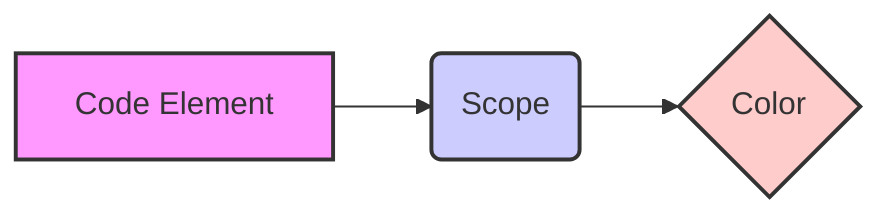

## 1. Introduction

In VSCode or Cursor, a well-configured code highlighting setup can significantly improve the reading and development efficiency of Go language. Imagine if your code was as colorful as a rainbow, with different elements distinguished by different colors - wouldn't that feel great?

This article will introduce how to configure themes and customize highlighting rules to make your VSCode/Cursor have a Material theme effect similar to GoLand/IDEA, thereby achieving a better code reading experience. The Material Theme is beloved by developers for its simple, modern design style and clear distinction of code elements. Through this article, you will learn how to create a code reading environment that is both beautiful and practical.

### 1.1. Why is Code Highlighting Important?

- **Improves Readability**: Different colors can distinguish different code elements, such as variables, functions, keywords, etc., making code easier to read and understand.
- **Reduces Errors**: Clear highlighting can help you quickly find errors in code, such as spelling errors, syntax errors, etc.
- **Enhances Development Efficiency**: Good code highlighting allows you to locate key parts of the code faster, thereby improving development efficiency.

### 1.2. What is Material Theme?

Material Theme is a theme style based on the Material Design language, beloved by developers for its simple, modern design style and clear distinction of code elements. Material Theme typically uses dark backgrounds and high-contrast bright colors, making code easier to read and understand.

## 2. Basic Concepts

Before starting to configure code highlighting, we need to understand some basic concepts, such as TextMate syntax rules and Scope.

### 2.1. TextMate Syntax Rules

TextMate is a text editor's syntax highlighting rule that VSCode and Cursor both support. TextMate syntax rules use regular expressions to match different elements in code and assign them different colors.

### 2.2. Scope

Scope is an important concept in TextMate syntax rules, used to describe the scope of code elements. For example, `entity.name.function` represents the scope of a function name, and `variable.other` represents the scope of a variable.

By specifying colors for different Scopes, we can achieve highlighting of different code elements.

#### 2.2.1. Scope Diagram



The above diagram shows the relationship between code elements, Scope, and colors. Code elements determine their scope through Scope, and then are highlighted according to the color specified by the Scope.

### 2.3. How to Find Scope?

In VSCode, you can use the "Developer: Inspect Editor Tokens and Scopes" command to find the Scope of code elements.

1. Press `Ctrl+Shift+P`, enter "Developer: Inspect Editor Tokens and Scopes".
2. Move the cursor to the code element you want to find the Scope for.
3. In the popup panel, you can see the Scope of that code element.

## 3. Theme Selection and Installation

### 3.1. Themes

- **One Monokai (Recommended)**
  - The One Monokai theme itself has a dark base color, usually with black or dark gray as the main background, paired with high-contrast bright colors to highlight code elements.
- **Other Theme Recommendations**
  - Material Theme: Provides multiple Material Design style themes, you can choose according to your preferences.
  - Dracula: A popular dark theme with good color matching and contrast.
  - Atom One Dark: The classic theme from the Atom editor, simple and comfortable.

### 3.2. Installing and Enabling Themes

1. Open VSCode/Cursor, click the Extensions icon on the left side.
2. Enter the theme name in the search box, such as "One Monokai".
3. Find the corresponding theme, click "Install".
4. After installation, click "Enable", or select the theme via the `Ctrl+K Ctrl+T` shortcut.

## 4. Language Server Installation

```go
go install golang.org/x/tools/gopls@latest
```

`gopls` is the official Go implementation of the Language Server Protocol (LSP), providing VSCode/Cursor with code completion, syntax checking, formatting, refactoring, and other features.

## 5. VSCode/Cursor settings.json Configuration

### 5.1. Enable useLanguageServer

Ctrl+Shift+P, enter `setting.json` --> `open user setting`

```json
"go.useLanguageServer": true
```

### 5.2. Configure gopls

```json
"gopls": {
  "ui.semanticTokens": true,
  "formatting.gofumpt": true
}
```

- `ui.semanticTokens`: Enable semantic highlighting for more accurate code element recognition.
- `formatting.gofumpt`: Use `gofumpt` for code formatting, which is stricter and more elegant than `go fmt`.

### 5.3. Code Line Height Adjustment

```json
"editor.lineHeight": 2.3
```

### 5.4. Code Font Adjustment

```json
"editor.fontFamily": "'Menlo', 'Droid Sans Mono', 'monospace', monospace",
```

## 6. Code Highlighting Adjustments

### 6.1. Function Name (`entity.name.function`)

- Original color: `#cb78db` (light purple)
- Recommended color: `#ff8b59` (orange)
  - Reason: Orange is very eye-catching on a dark background and matches well with the overall One Monokai style, clearly highlighting function names.
- Alternative color: `#ff79c6` (pink)
  - Reason: Pink is also eye-catching on a dark background and has a modern feel.

### 6.2. Variables (`variable.other`)

- Original color: `#b3995a` (light yellow)
- Recommended color: `#8be9fd` (sky blue)
  - Reason: Sky blue has high contrast on a dark background and gives a fresh, readable feeling, suitable for variables.
- Alternative color: `#a1eef9` (light blue)
  - Reason: Light blue is softer, not too glaring, and can also highlight variables well.

### 6.3. Strings (`string`)

- Original color: `#67e220ad` (semi-transparent green)
- Recommended color: `#50fa7b` (bright green)
  - Reason: Bright green has high contrast on a dark background, and green is commonly used for strings, consistent with programming conventions.
- Alternative color: `#aaffc3` (light green)
  - Reason: Light green is softer, suitable for long-term reading, and can also highlight string content well.

### 6.4. Configuration Section

```json
"editor.tokenColorCustomizations": {
  "[One Monokai]": {
    "textMateRules": [
      {
        "scope": "entity.name.function",
        "settings": {
          "foreground": "#ff8b59" // Orange, eye-catching and matches overall style
        },
      },
      {
        "scope": "variable.other",
        "settings": {
          "foreground": "#8be9fd" // Sky blue, fresh and readable
        }
      },
      {
        "scope": "string",
        "settings": {
          "foreground": "#50fa7b" // Bright green, consistent with common string coloring
        }
      }
    ]
  }
}
```

### 6.5. Other Adjustable Element Color Suggestions

If you want to adjust the colors of other code elements, here are some common suggestions:

- Comments (`comment`): Can use gray tones, such as `#6272a4`, keeping low-key but clearly readable.
- Keywords (`keyword`): Can use bright yellow tones, such as `#f1fa8c`, highlighting the importance of keywords.
- Types (`entity.name.type`): Can use cyan tones, such as `#8be9fd`, distinguishing from variables.
- Constants (`constant.language`): Can use light purple tones, such as `#bd93f9`, contrasting with function names while maintaining overall coordination.
- Numbers (`constant.numeric`): Can use light purple tones, such as `#bd93f9`, contrasting with function names while maintaining overall coordination.
- Struct Names (`entity.name.struct`): Can use orange tones, such as `#ff8b59`, consistent with function names.
- Interface Names (`entity.name.interface`): Can use cyan tones, such as `#8be9fd`, consistent with types.

### 6.6. Practical Examples

#### 6.6.1. Highlighting Struct Names

```json
{
  "scope": "entity.name.struct",
  "settings": {
    "foreground": "#ff8b59" // Orange, eye-catching and matches overall style
  }
}
```

#### 6.6.2. Highlighting Interface Names

```json
{
  "scope": "entity.name.interface",
  "settings": {
    "foreground": "#8be9fd" // Cyan, consistent with types
  }
}
```

## 7. Advanced Configuration

### 7.1. Font Style

You can set font styles through `editor.fontStyle`, such as `italic` (italic), `bold` (bold), etc.

```json
"editor.fontStyle": "italic"
```

### 7.2. Font Size

You can set font size through `editor.fontSize`, adjusting according to your preferences.

```json
"editor.fontSize": 14
```

### 7.3. Line Height

You can set line height through `editor.lineHeight`, adding breathing space to the code.

```json
"editor.lineHeight": 1.6
```

## 8. Troubleshooting

### 8.1. Highlighting Not Working

- Check if theme is enabled: Make sure you've selected and enabled the corresponding theme.
- Check `setting.json` syntax: Ensure the `setting.json` file has no syntax errors.
- Restart VSCode/Cursor: Sometimes restarting the editor can solve some strange issues.
- Check if `gopls` is working properly: You can view `gopls` logs in VSCode/Cursor's "Output" panel.
- Check if Scope is correct: Use the "Developer: Inspect Editor Tokens and Scopes" command to check if the Scope is correct.

### 8.2. `gopls` Errors

- Update `gopls`: Make sure you're using the latest version of `gopls`.
- Check Go version: Make sure your Go version meets `gopls` requirements.
- View `gopls` logs: You can view `gopls` logs in VSCode/Cursor's "Output" panel to understand specific error messages.

## 9. Reference Links

- VSCode Official Documentation: [https://code.visualstudio.com/docs](https://code.visualstudio.com/docs)
- Cursor Official Documentation: [https://cursor.sh/docs](https://cursor.sh/docs)
- gopls Official Documentation: [https://github.com/golang/tools/tree/master/gopls](https://github.com/golang/tools/tree/master/gopls)
- VSCode Syntax Highlighting Guide: [https://code.visualstudio.com/api/language-extensions/syntax-highlight-guide](https://code.visualstudio.com/api/language-extensions/syntax-highlight-guide)
- VSCode Semantic Highlighting Guide: [https://code.visualstudio.com/api/language-extensions/semantic-highlight-guide](https://code.visualstudio.com/api/language-extensions/semantic-highlight-guide)
- TextMate Syntax Rules: [https://macromates.com/manual/en/language_grammars](https://macromates.com/manual/en/language_grammars)

## 10. Summary

This document provides detailed instructions on how to configure Go language code highlighting in VSCode/Cursor, including theme selection, `gopls` configuration, code element coloring, advanced configuration, and troubleshooting. Through proper configuration, you can significantly improve Go language reading and development efficiency.

I hope this article can help you create a code reading environment that is both beautiful and practical. If you want to learn more about code highlighting configuration, you can refer to the following resources:

- VSCode Official Documentation
- TextMate Syntax Rules

Hope these suggestions help you better adjust VSCode's code highlighting colors!

