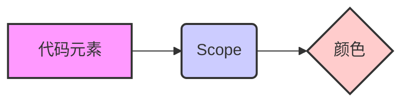

## 1. 引言

在 VSCode 或 Cursor 中，良好的代码高亮配置能够显著提升 Go 语言的阅读和开发效率。想象一下，如果你的代码像彩虹一样绚丽多彩，不同的元素都用不同的颜色区分开来，是不是感觉很棒？

本文将介绍如何通过配置主题和自定义高亮规则，使你的 VSCode/Cursor 拥有类似 Goland/Idea 的 Material 主题效果，从而获得更佳的代码阅读体验。Material Theme 以其简洁、现代的设计风格，以及对代码元素的清晰区分而备受开发者喜爱。通过本文，你将学会如何打造一个既美观又实用的代码阅读环境。

### 1.1. 为什么代码高亮很重要？

- **提高可读性**：不同的颜色可以区分不同的代码元素，例如变量、函数、关键字等，使代码更易于阅读和理解。
- **减少错误**：清晰的高亮可以帮助你快速发现代码中的错误，例如拼写错误、语法错误等。
- **提升开发效率**：良好的代码高亮可以让你更快地定位到代码中的关键部分，从而提升开发效率。

### 1.2. 什么是 Material Theme？

Material Theme 是一种基于 Material Design 设计语言的主题风格，以其简洁、现代的设计风格和对代码元素的清晰区分而备受开发者喜爱。Material Theme 通常采用深色背景和高对比度的亮色，使代码更易于阅读和理解。

## 2. 基础概念

在开始配置代码高亮之前，我们需要了解一些基础概念，例如 TextMate 语法规则和 Scope。

### 2.1. TextMate 语法规则

TextMate 是一种文本编辑器的语法高亮规则，VSCode 和 Cursor 都支持 TextMate 语法规则。TextMate 语法规则使用正则表达式来匹配代码中的不同元素，并为其指定不同的颜色。

### 2.2. Scope

Scope 是 TextMate 语法规则中的一个重要概念，它用于描述代码元素的作用域。例如，`entity.name.function` 表示函数名称的作用域，`variable.other` 表示变量的作用域。

通过指定不同 Scope 的颜色，我们可以实现对不同代码元素的高亮。

#### 2.2.1. Scope 图解



上图展示了代码元素、Scope 和颜色之间的关系。代码元素通过 Scope 来确定其作用域，然后根据 Scope 指定的颜色进行高亮。

### 2.3. 如何查找 Scope？

在 VSCode 中，可以使用 "Developer: Inspect Editor Tokens and Scopes" 命令来查找代码元素的 Scope。

1.  按下 `Ctrl+Shift+P`，输入 "Developer: Inspect Editor Tokens and Scopes"。
2.  将光标移动到要查找 Scope 的代码元素上。
3.  在弹出的面板中，可以看到该代码元素的 Scope。

## 3. 主题选择与安装

### 3.1. 主题

- **One Monokai (推荐)**
  - One Monokai 主题本身底色是深色系的，通常以黑色或深灰色为主背景，搭配高对比度的亮色来突出代码元素。
- **其他主题推荐**
  - Material Theme: 提供了多种 Material Design 风格的主题，可以根据自己的喜好选择。
  - Dracula: 一款流行的暗色主题，拥有良好的色彩搭配和对比度。
  - Atom One Dark: Atom 编辑器的经典主题，简洁而舒适。

### 3.2. 安装与启用主题

1.  打开 VSCode/Cursor，点击左侧的扩展图标 (Extensions)。
2.  在搜索框中输入主题名称，例如 "One Monokai"。
3.  找到对应的主题，点击 "安装" (Install)。
4.  安装完成后，点击 "启用" (Enable)，或者通过 `Ctrl+K Ctrl+T` 快捷键选择主题。

## 4. 语言解析服务安装

```go
go install golang.org/x/tools/gopls@latest
```

`gopls` 是 Go 官方提供的语言服务器协议 (LSP) 实现，为 VSCode/Cursor 提供代码补全、语法检查、格式化、重构等功能。

## 5. VSCode/Cursor 的 setting.json 配置

### 5.1. 开启 useLanguageServer

Ctrl+Shift+P, 输入 `setting.json` --> `open user setting`

```json
"go.useLanguageServer": true
```

### 5.2. 配置 gopls

```json
"gopls": {
  "ui.semanticTokens": true,
  "formatting.gofumpt": true
}
```

- `ui.semanticTokens`: 启用语义高亮，可以更准确地识别代码元素。
- `formatting.gofumpt`: 使用 `gofumpt` 进行代码格式化，比 `go fmt` 更加严格和美观。

### 5.3. 代码行高度调整

```json
"editor.lineHeight": 2.3
```

### 5.4. 代码字体调整

```json
"editor.fontFamily": "'Menlo', 'Droid Sans Mono', 'monospace', monospace",
```

## 6. 代码高亮调整

### 6.1. 函数名称（`entity.name.function`）

- 原配色：`#cb78db`（淡紫色）
- 建议配色：`#ff8b59`（橙色系）
  - 理由：橙色在深色背景上非常醒目，且与 One Monokai 的整体风格搭配得很好，能够清晰突出函数名称。
- 备选配色：`#ff79c6`（粉色系）
  - 理由：粉色在深色背景上也很醒目，同时带有一种现代感。

### 6.2. 变量（`variable.other`）

- 原配色：`#b3995a`（淡黄色）
- 建议配色：`#8be9fd`（天蓝色）
  - 理由：天蓝色在深色背景上对比度高，且给人一种清新、易读的感觉，适合用于变量。
- 备选配色：`#a1eef9`（浅蓝色）
  - 理由：浅蓝色更加柔和，不会过于刺眼，同时也能很好地突出变量。

### 6.3. 字符串（`string`）

- 原配色：`#67e220ad`（半透明的绿色）
- 建议配色：`#50fa7b`（亮绿色）
  - 理由：亮绿色在深色背景上对比度高，且绿色通常用于表示字符串，符合编程习惯。
- 备选配色：`#aaffc3`（浅绿色）
  - 理由：浅绿色更加柔和，适合长时间阅读，同时也能很好地突出字符串内容。

### 6.4. 配置部分

```json
"editor.tokenColorCustomizations": {
  "[One Monokai]": {
    "textMateRules": [
      {
        "scope": "entity.name.function",
        "settings": {
          "foreground": "#ff8b59" // 橙色系，醒目且搭配整体风格
        },
      },
      {
        "scope": "variable.other",
        "settings": {
          "foreground": "#8be9fd" // 天蓝色，清新易读
        }
      },
      {
        "scope": "string",
        "settings": {
          "foreground": "#50fa7b" // 亮绿色，符合字符串的常见配色
        }
      }
    ]
  }
}
```

### 6.5. 其他可调整的元素配色建议

如果你还希望调整其他代码元素的颜色，以下是一些常见的建议：

- 注释（`comment`）：可以使用灰色系，如 `#6272a4`，保持低调但清晰可读。
- 关键字（`keyword`）：可以使用亮黄色系，如 `#f1fa8c`，突出关键字的重要性。
- 类型（`entity.name.type`）：可以使用青色系，如 `#8be9fd`，与变量区分开来。
- 常量（`constant.language`）：可以使用淡紫色系，如 `#bd93f9`，与函数名称形成对比，同时保持整体协调。
- 数字（`constant.numeric`）：可以使用淡紫色系，如 `#bd93f9`，与函数名称形成对比，同时保持整体协调。
- Struct 名称 (`entity.name.struct`)：可以使用橙色系，如 `#ff8b59`，与函数名称保持一致。
- Interface 名称 (`entity.name.interface`)：可以使用青色系，如 `#8be9fd`，与类型保持一致。

### 6.6. 实践案例

#### 6.6.1. 高亮 Struct 名称

```json
{
  "scope": "entity.name.struct",
  "settings": {
    "foreground": "#ff8b59" // 橙色系，醒目且搭配整体风格
  }
}
```

#### 6.6.2. 高亮 Interface 名称

```json
{
  "scope": "entity.name.interface",
  "settings": {
    "foreground": "#8be9fd" // 青色系，与类型保持一致
  }
}
```

## 7. 高级配置

### 7.1. 字体样式

可以通过 `editor.fontStyle` 设置字体样式，例如 `italic`（斜体）、`bold`（粗体）等。

```json
"editor.fontStyle": "italic"
```

### 7.2. 字号

可以通过 `editor.fontSize` 设置字号，根据自己的喜好调整。

```json
"editor.fontSize": 14
```

### 7.3. 行高

可以通过 `editor.lineHeight` 设置行高，增加代码的呼吸感。

```json
"editor.lineHeight": 1.6
```

## 8. 问题排查

### 8.1. 高亮不生效

- 检查主题是否已启用：确保已选择并启用了对应的主题。
- 检查 `setting.json` 语法：确保 `setting.json` 文件没有语法错误。
- 重启 VSCode/Cursor：有时候重启编辑器可以解决一些奇怪的问题。
- 检查 `gopls` 是否正常工作：可以在 VSCode/Cursor 的 "输出" (Output) 面板中查看 `gopls` 的日志。
- 检查 Scope 是否正确：使用 "Developer: Inspect Editor Tokens and Scopes" 命令检查 Scope 是否正确。

### 8.2. `gopls` 报错

- 更新 `gopls`：确保你使用的 `gopls` 是最新版本。
- 检查 Go 版本：确保你的 Go 版本符合 `gopls` 的要求。
- 查看 `gopls` 日志：可以在 VSCode/Cursor 的 "输出" (Output) 面板中查看 `gopls` 的日志，了解具体的错误信息。

## 9. 参考链接

- VSCode 官方文档: [https://code.visualstudio.com/docs](https://code.visualstudio.com/docs)
- Cursor 官方文档: [https://cursor.sh/docs](https://cursor.sh/docs)
- gopls 官方文档: [https://github.com/golang/tools/tree/master/gopls](https://github.com/golang/tools/tree/master/gopls)
- VSCode 语法高亮指南: [https://code.visualstudio.com/api/language-extensions/syntax-highlight-guide](https://code.visualstudio.com/api/language-extensions/syntax-highlight-guide)
- VSCode 语义高亮指南: [https://code.visualstudio.com/api/language-extensions/semantic-highlight-guide](https://code.visualstudio.com/api/language-extensions/semantic-highlight-guide)
- TextMate 语法规则: [https://macromates.com/manual/en/language_grammars](https://macromates.com/manual/en/language_grammars)

## 10. 总结

本文档详细介绍了如何在 VSCode/Cursor 中配置 Go 语言的代码高亮，包括主题选择、`gopls` 配置、代码元素配色、高级配置以及问题排查。通过合理的配置，可以显著提升 Go 语言的阅读和开发效率。

希望本文能够帮助你打造一个既美观又实用的代码阅读环境。如果你想进一步学习代码高亮配置，可以参考以下资源：

- VSCode 官方文档
- TextMate 语法规则

希望这些建议能帮助你更好地调整 VSCode 的代码高亮配色！
