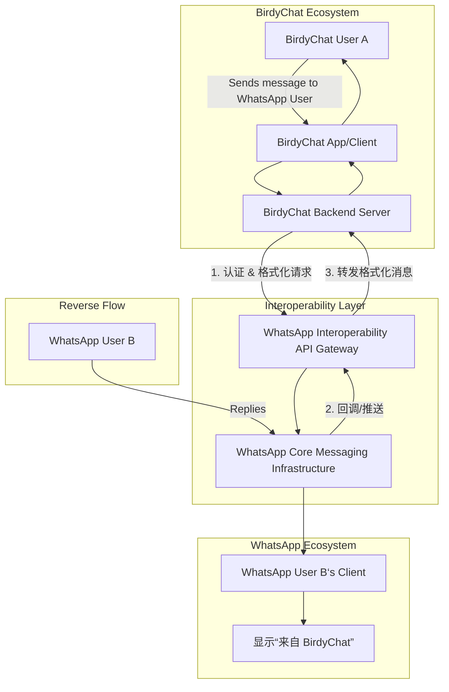

## 文章摘要

BirdyChat，一家总部位于瑞士的即时通讯服务商，宣布其已成为欧洲首个与 Meta 旗下的 WhatsApp 实现互操作性（Interoperability）的第三方聊天应用。这一里程碑式的成就并非偶然的技术突破，而是直接响应并利用了欧盟具有里程碑意义的《数字市场法案》（Digital Markets Act, DMA）。DMA 将 Meta 等大型科技公司指定为“守门人”，并强制要求其核心平台服务（如 WhatsApp 的即时通讯功能）必须向第三方提供互操作性。BirdyChat 的案例标志着监管力量首次成功撬动了封闭的“围墙花园”，为用户提供了真正的选择权，无需切换应用即可与 WhatsApp 用户交流。本文将从技术实现、法规驱动、市场影响和未来挑战等多个维度，深度剖析这一事件背后的深远意义。

## 背景与问题

在过去的十年里，全球即时通讯市场被少数几个“超级应用”所主导，如 WhatsApp、Facebook Messenger、iMessage 和微信。这些平台构建了强大的网络效应和封闭的生态系统，形成了所谓的“围墙花园”（Walled Gardens）。用户被锁定在特定的平台内，因为他们的社交关系网都在那里。跨平台通信要么体验割裂（如使用短信与 iMessage 用户沟通），要么根本不存在。这种市场格局扼杀了创新，限制了用户选择，并赋予了平台所有者过度的市场权力。

欧盟的《数字市场法案》（DMA）正是为了应对这一挑战而生。该法案于 2022 年通过，并于 2024 年 3 月开始全面实施。DMA 的核心目标是通过引入事前监管规则，确保数字市场的公平性和可竞争性。它将满足特定规模标准的大型在线平台指定为“守门人”（Gatekeeper），并对其施加一系列义务，其中最关键的一条就是**互操作性义务**。对于被指定为守门人的即时通讯服务（如 WhatsApp 和 Facebook Messenger），DMA 要求它们必须允许第三方服务与其用户进行通信。

**为什么这个问题至关重要？**
1.  **打破垄断与促进竞争**：互操作性直接挑战了基于网络效应的垄断。它允许新进入者（如 BirdyChat）无需从头重建一个庞大的用户网络，就能提供有价值的服务，从而在功能、隐私、商业模式上进行创新。
2.  **重塑用户主权**：用户首次可以基于应用本身的功能、隐私政策或价值观做出选择，而不再被“我的朋友都在那里”所绑架。这赋予了用户真正的选择自由。
3.  **数据主权与隐私**：欧洲本土的应用可能提供更符合 GDPR 精神的数据处理方式，将数据存储在欧盟境内，减少对非欧盟科技巨头的依赖。
4.  **技术标准的演进**：强制互操作性将推动行业重新审视和采用开放的通信协议（如 XMPP, Matrix），可能引领新一轮去中心化通信协议的发展。

BirdyChat 正是在这一历史性监管变革的背景下，率先完成了与 WhatsApp 的互操作性对接，成为了 DMA 规则下的第一个实践案例和“吃螃蟹的人”。

## 核心内容解析

### 3.1 核心观点提取

-   **观点一：监管是打破技术壁垒的关键驱动力。**
    BirdyChat 的成功对接并非因为 Meta 主动开放，而是 DMA 法律强制力的直接结果。这凸显了在市场自我调节失灵时，强有力的监管框架对于重塑数字市场秩序的必要性。技术实现本身可能复杂，但缺乏法律义务，守门人企业几乎没有动力去主动拆除自己的围墙。

-   **观点二：互操作性是一个分阶段、有限度的开放过程。**
    根据 DMA 的规定，互操作性并非一蹴而就。最初阶段（DMA 生效后）仅要求支持**一对一文本消息和文件、图片、语音消息的发送**。视频通话和群聊的互操作性要求将在未来四年内逐步实施。这种渐进式路径既考虑了技术实现的复杂性，也给了各方适应的时间。BirdyChat 目前实现的正是第一阶段的文本和媒体消息互通。

-   **观点三：实现路径依赖于“守门人”提供的接口。**
    第三方应用（BirdyChat）需要与“守门人”（WhatsApp）提供的标准化接口（API）进行对接。这意味着互操作性的具体形式、延迟、功能范围在很大程度上由 WhatsApp 决定。BirdyChat 的角色是遵循 WhatsApp 公布的规范完成集成。这引发了一个关键问题：守门人是否会设计出对第三方不友好或高成本的接口，从而变相阻碍互操作性？欧盟委员会将负责监督接口的公平性、合理性和非歧视性。

-   **观点四：用户体验与信任是最大挑战。**
    当 BirdyChat 用户向 WhatsApp 用户发送消息时，WhatsApp 用户端会明确显示该消息“来自 BirdyChat”。这引入了新的用户体验维度：用户需要理解并信任来自不同平台的消息。如何确保跨平台通信的安全性（端到端加密是否延续？）、垃圾信息控制、身份验证机制，是技术实现之外更棘手的挑战。

-   **观点五：这是欧洲科技主权战略的一次小规模胜利。**
    BirdyChat 作为一家欧洲公司，率先利用欧洲的法规在欧洲市场取得突破，具有强烈的象征意义。它展示了在监管框架的扶持下，本土创新者有机会在由美国科技巨头主导的领域内获得一席之地，推动欧洲的“数字主权”战略。

### 3.2 技术深度分析

互操作性的技术实现并非简单地将两个应用的后台数据库连接起来。它涉及复杂的协议转换、身份管理、安全模型同步和实时通信协调。

**1. 核心架构：基于 API 的桥梁模式**
最可能的实现模式是，Meta 为 WhatsApp 设计并公开了一套 **互操作性 API**。这套 API 定义了第三方服务如何：
-   **身份验证与注册**：第三方应用（如 BirdyChat）需要向 WhatsApp 的互操作性服务注册，并获得认证凭证。
-   **用户标识映射**：如何将 BirdyChat 用户的标识符（如电话号码或应用内 ID）与 WhatsApp 的用户标识符进行关联或解析。电话号码很可能成为初始阶段的通用标识符。
-   **消息路由**：BirdyChat 服务器通过调用 WhatsApp 的 API，将格式化的消息（包含接收方标识符、消息内容、元数据）发送给 WhatsApp 的互操作性网关。该网关负责将消息投递给目标 WhatsApp 用户。
-   **消息接收**：同样，WhatsApp 需要将来自其用户、目标是 BirdyChat 用户的消息，通过回调（Webhook）或另一个 API 端点推送给 BirdyChat 的服务器。

**2. 端到端加密（E2EE）的延续性挑战**
这是技术上的最大难点之一。WhatsApp 和 BirdyChat 可能使用不同的 E2EE 协议（如 WhatsApp 使用 Signal 协议）。要实现跨平台的 E2EE，有两种主要思路：
-   **协议转换网关**：由守门人（WhatsApp）运营一个受信任的“互操作性服务”，该服务分别与 WhatsApp 客户端和第三方服务建立独立的 E2EE 会话。消息在网关处短暂解密后立即重新加密转发。但这引入了“中间人”，降低了信任模型。
-   **统一的开放协议**：理想情况下，双方都支持同一个开放的 E2EE 协议（如 MLS - Messaging Layer Security）。DMA 鼓励采用或兼容欧洲标准，这可能会推动 MLS 等协议成为事实标准。但在初期，更可能采用第一种折中方案，并明确告知用户加密边界的变化。

**3. 元数据与隐私**
即使消息内容加密，大量的**元数据**（谁在何时与谁通信、频率、设备信息等）会在平台间交换。DMA 和 GDPR 要求对这些数据的处理必须透明、合法、最小化。BirdyChat 和 WhatsApp 需要明确告知用户，在互操作过程中会共享哪些元数据，用于何种目的（如投递、防滥用、计费）。

**4. 垃圾信息与安全控制**
互操作性打开了新的滥用渠道。WhatsApp 必须将其强大的垃圾信息检测和安全控制机制部分延伸到来自第三方平台的消息流。这可能涉及信誉系统、速率限制、内容扫描（在符合隐私法规的前提下）以及快速的滥用报告和处置通道的共享。BirdyChat 同样有责任管理好自己的用户，防止其成为垃圾信息的源头。

### 3.3 实践应用场景

-   **对于创新型通讯创业公司**：BirdyChat 提供了一个清晰的蓝图。新入场的玩家可以将资源集中于打造差异化的用户体验（如更好的群组管理、与生产力工具的集成、基于订阅的无广告模式、更强的隐私功能），而无需担心冷启动时的用户网络问题。他们的价值主张可以变为：“使用我们，你仍然可以和所有 WhatsApp 好友无缝聊天。”
-   **对于企业通信与客户服务**：企业可能选择使用一个符合更严格数据合规要求（如 GDPR, CCPA）的欧洲通讯平台作为其官方客户沟通渠道。通过互操作性，企业员工可以用这个平台直接与使用 WhatsApp 的客户沟通，无需强迫客户下载新应用，同时满足企业内部的数据治理政策。
-   **对于特定社区和垂直领域**：专注于游戏、音乐、专业协作的通讯应用可以发展起来，并通过互操作性与主流平台连接，服务于特定的兴趣圈层，而不被主流社交图谱所孤立。
-   **对于开源和去中心化项目**：像 Matrix 这样的开源、去中心化通讯协议项目迎来了巨大机遇。如果 Matrix 客户端能通过桥接（Bridges）实现与 WhatsApp 的合规互操作，将极大地推动去中心化生态的普及。事实上，Element（Matrix 的创始公司）等已在积极准备利用 DMA 规则。

## 深度分析与思考

### 4.1 文章价值与意义

BirdyChat 的公告远不止一则商业新闻，它是一个强烈的**信号事件**。它向全球的科技行业、监管机构和创业者证明：
1.  **DMA 是“有牙齿”的法规**：它不仅仅是一纸文书，其规定的义务正在被实际执行并产生可见的结果。这增强了监管的公信力，并可能激励其他地区（如美国、英国、印度）考虑类似的立法。
2.  **互操作性在技术上是可以实现的**：尽管面临加密、规模、安全等挑战，但 BirdyChat 与 WhatsApp 的对接成功，打破了“技术不可行”的常见托辞，为后续更多的互操作性案例扫清了心理和技术验证障碍。
3.  **开启了平台经济的新范式**：从“赢家通吃”的封闭生态，转向“核心平台+多元服务”的开放生态。守门人平台可能逐渐演变为数字时代的基础设施（如同电信网络），而创新和价值创造将更多发生在应用层。

### 4.2 对读者的实际应用价值

-   **产品经理与创业者**：需要重新评估即时通讯赛道的竞争格局和入场策略。互操作性降低了网络效应的壁垒，竞争焦点可能从“获取用户”转向“留住用户”（通过卓越体验、隐私、特色功能）。应深入研究 DMA 细则和守门人公布的 API 文档。
-   **开发者与工程师**：需要学习与大型平台互操作性 API 的集成技术，理解跨平台通信的安全模型（如 MLS 协议），并掌握在分布式、异构系统中构建可靠、安全通信服务的能力。这是一个新兴且需求增长的技术领域。
-   **法务与合规专家**：必须深入理解 DMA 及其在各成员国的执行细则，帮助企业（无论是作为守门人、第三方还是依赖这些平台的企业用户）进行合规评估和风险管控。
-   **普通用户与倡导者**：获得了宝贵的知情权和选择权。用户现在可以更有意识地选择通讯工具，并关注不同平台在隐私、数据存储、商业模式上的差异，用脚投票。

### 4.3 可能的实践场景

-   **项目应用**：
    -   **开发一个注重隐私的通讯应用**：集成 WhatsApp/ Messenger 互操作性 API，主打“无元数据记录”、“本地化存储”、“订阅制”等卖点。
    -   **为企业构建合规通信中台**：开发一个平台，统一管理来自 WhatsApp、未来可能的 iMessage 以及其他社交渠道的客户消息，确保所有通信符合行业法规（如金融、医疗）。
    -   **为开源协议构建合规桥接**：为 Matrix、XMPP 等协议开发高质量、符合 DMA 要求的官方“守门人平台桥接器”。
-   **学习路径**：
    1.  通读欧盟委员会发布的 **DMA 全文** 及相关指导文件。
    2.  关注 **Meta for Developers** 等守门人平台发布的互操作性 API 官方文档和技术博客。
    3.  学习 **Messaging Layer Security (MLS)** 协议 RFC，理解下一代安全群组通信标准。
    4.  研究 **BirdyChat** 等先行者的技术分享（如果未来他们公开细节）。
-   **工具与资源**：
    -   **欧盟官方渠道**：European Commission - Digital Markets Act
    -   **守门人开发者门户**：Meta for Developers, Apple Developer (关注未来 iMessage 相关更新)
    -   **协议标准**：IETF MLS Working Group, Matrix.org Specification

### 4.4 个人观点与思考

BirdyChat 迈出了第一步，但前路依然漫长且布满荆棘。

**潜在的挑战与问题**：
1.  **接口质量与“合规性规避”风险**：守门人可能提供性能低下、功能残缺、文档晦涩或收费高昂的 API，变相维持其垄断地位。欧盟监管机构的监督能力和技术审计能力将面临严峻考验。
2.  **安全与信任的稀释**：跨平台通信可能成为网络钓鱼、诈骗的新温床。用户需要教育，平台需要建立跨生态的联合安全机制。一个平台的安全漏洞可能通过互操作性波及其他平台。
3.  **商业模式的冲击**：WhatsApp 的商业化（如商业 API、支付）可能受到干扰。第三方应用可能以更低的价格提供类似服务，或通过差异化服务分流用户。这可能导致守门人寻求在其他方面（如硬件、云服务）巩固其优势。
4.  **碎片化的用户体验**：用户可能面临多个通讯应用、不同的功能集（有的支持群聊互通，有的不支持）、不一致的通知设置等问题。真正的“无缝”体验很难实现。

**未来展望**：
互操作性将不再局限于即时通讯。DMA 的要求将逐步扩展到**社交网络**（如让用户在 Mastodon 上关注 Facebook 好友）、**移动操作系统**（如更自由地设置默认应用、卸载预装软件）等领域。BirdyChat 与 WhatsApp 的互通，只是这场重塑整个数字生活基础结构的宏大变革的序章。最终，我们可能走向一个更开放、更可互操作、用户拥有更多控制权的互联网，但这需要技术社区、监管机构和市场参与者持续的努力、博弈与协作。

## 技术栈/工具清单

虽然 BirdyChat 和 WhatsApp 的具体实现细节未完全公开，但基于行业实践和 DMA 要求，可以推断涉及以下技术范畴：

-   **核心协议与标准**：
    -   **Signaling/Transport**: 可能基于 **XMPP** 的变体、自定义二进制协议或 **HTTP/3** 与 **WebSockets** 用于 API 通信。
    -   **端到端加密**: **Signal Protocol** (WhatsApp 现有)，未来可能向 **Messaging Layer Security (MLS)** 协议迁移以实现更好的跨平台群聊加密。
    -   **身份标识**: 初期很可能依赖 **MSISDN (手机号码)** 作为通用用户标识符，辅以应用内唯一 ID。
-   **API 与接口**：
    -   **RESTful API / gRPC**: 用于互操作性服务的主要通信接口，由守门人（Meta）定义和提供。
    -   **Webhooks**: 用于守门人向第三方服务（BirdyChat）推送来自其用户的消息。
    -   **OAuth 2.0 / Client Credentials Grant**: 用于第三方应用服务器向守门人互操作性服务进行认证和授权。
-   **基础设施**：
    -   **高可用消息队列** (如 Apache Kafka, RabbitMQ): 处理跨平台消息的路由、排队和保证送达。
    -   **分布式数据库**：用于存储映射关系、会话状态和消息元数据。
    -   **容器化与编排** (Docker, Kubernetes): 确保互操作性服务的高可扩展性和弹性。
-   **安全与合规工具**：
    -   **安全密钥管理服务** (KMS): 管理加密密钥。
    -   **审计日志系统**: 满足 DMA 和 GDPR 的审计要求。
    -   **反滥用与内容过滤系统**: 识别和拦截跨平台的垃圾信息与恶意内容。

## 相关资源与延伸阅读

1.  **原始文章**：[BirdyChat becomes first European chat app that is interoperable with WhatsApp](https://www.birdy.chat/blog/first-to-interoperate-with-whatsapp) - 本文分析的起点。
2.  **欧盟委员会 DMA 主页**：[Digital Markets Act](https://ec.europa.eu/commission/presscorner/detail/en/qanda_22_