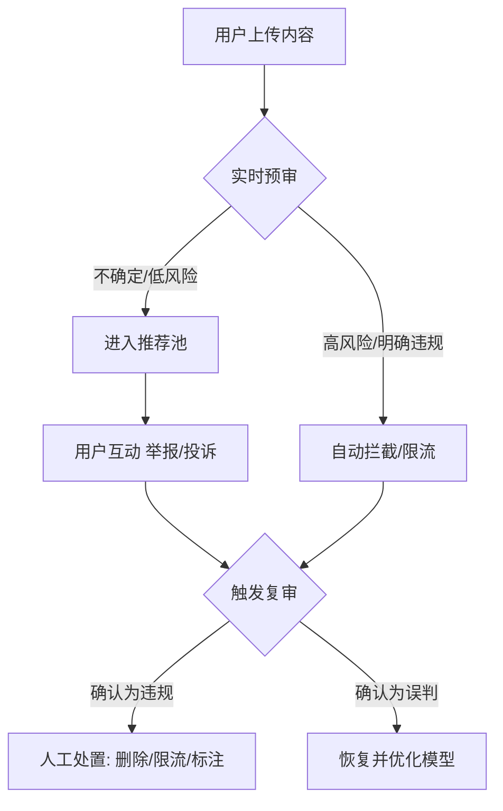

## 文章摘要

近期，喜剧演员梅根·斯塔特（Megan Stalter）和音乐人芬尼斯·奥康奈尔（Finneas）在 TikTok 上公开发表批评美国移民和海关执法局（ICE）的言论后，声称其内容遭到平台的审查和限流。这一事件并非孤例，它揭示了 TikTok 等全球性社交媒体平台在内容审核上面临的复杂困境：既要遵守不同国家的法律法规和社区准则，又要应对来自政府、公众和创作者的多重压力。本文的核心在于，通过这一具体案例，深入剖析 TikTok 内容审核机制背后的技术逻辑、政策考量与伦理挑战。文章的价值在于，它不仅为内容创作者提供了应对平台审核的实用视角，也为技术从业者揭示了算法治理的深层矛盾，并引导所有用户思考在数字公共领域中，权力、责任与言论自由的边界究竟何在。

## 背景与问题

### 技术背景：社交媒体内容审核的演进与现状
在 Web 2.0 时代，用户生成内容（UGC）平台如 Facebook、YouTube、Twitter 和 TikTok 已成为全球信息传播的核心渠道。随之而来的，是海量、实时、多语言内容的审核需求。早期审核主要依赖用户举报和少量人工审核，但随着平台规模指数级增长和有害内容（如仇恨言论、虚假信息、暴力内容）的泛滥，**自动化内容审核系统**应运而生。这套系统通常结合了**机器学习（ML）模型**（如图像识别、自然语言处理 NLP、音频分析）和**人工审核团队**，依据平台制定的、通常长达数百页的《社区准则》进行操作。

TikTok 作为字节跳动旗下的全球化产品，其审核机制尤为复杂。它需要同时应对：
1.  **中国的内容监管法律环境**（如《网络安全法》）。
2.  **运营所在国（如美国、欧盟）的法律要求**（如美国的 FOSTA-SESTA 法案、欧盟的《数字服务法案》DSA）。
3.  **全球统一的社区价值观与商业利益**。
这种多国合规的“钢索行走”，使得 TikTok 的审核决策常常显得不透明且充满矛盾。

### 问题场景：名人、政治批评与“隐形审查”
本次事件的核心场景是：具有相当影响力的公众人物（Megan Stalter, Finneas），在一个以娱乐和创意为主的短视频平台上，对具有高度争议性的政府机构（ICE）提出批评，随后遭遇了疑似平台干预。用户报告的典型现象包括：**视频浏览量异常低迷、无法在“为你推荐”页面显示、评论功能受限、甚至账号被“影子封禁”（Shadow Banning）**——即不明确告知用户的情况下，限制其内容的传播范围。

这引出了一个尖锐的问题：当娱乐平台成为政治和社会讨论的场域时，平台的中立性如何界定？对政府机构的批评是否构成“违规内容”？平台的审核行为，是纯粹的技术性社区治理，还是隐含着政治性或商业性的考量？

### 为什么重要：平台权力、公共话语与数字权利
这个问题的重要性远超单个事件：
1.  **对创作者而言**：内容审核直接关系到其生计、表达自由和与粉丝的连接。不透明、不一致的审核规则会扼杀创意，制造寒蝉效应。
2.  **对技术行业而言**：它触及了**算法伦理**和**人机协同决策**的深水区。审核算法中的偏见如何被识别和消除？人工复审的流程是否公正？这些都是亟待解决的技术治理难题。
3.  **对社会而言**：社交媒体平台已成为事实上的“数字公共广场”。它们对内容的排序、推荐和删除，实质上在塑造公共议程和舆论走向。当平台可以对批评政府的内容进行“隐形”处理时，其对民主讨论的潜在影响不容忽视。
4.  **对法律与政策而言**：事件凸显了现有法律在规制全球性平台内容审核权力方面的滞后。各国正在探索的监管路径（如DSA要求透明度报告）将如何落地，本案提供了一个具体的观察窗口。

## 核心内容解析

### 3.1 核心观点提取

基于对原文事件的梳理与分析，我们可以提炼出以下核心观点：

- **观点一：内容审核的“灰度地带”是冲突高发区**
  对政府机构或政策的批评，往往处于平台社区准则中“允许的政治讨论”与“禁止的仇恨言论、骚扰或虚假信息”之间的模糊地带。TikTok 的审核系统可能在自动标记这类内容时过于敏感，或人工审核员在高压下倾向于“安全优先”而误判。

- **观点二：“影响力”是把双刃剑**
  名人账号拥有巨大声量，其批评性内容更容易引发广泛传播和争议，从而更快触发平台的“风险控制”机制。平台可能出于避免卷入重大政治风波、维护与当局关系或防止社区撕裂的考虑，对高影响力账号采取更谨慎（乃至限制性）的措施。

- **观点三：算法不透明加剧了信任危机**
  用户（包括名人）通常只能看到结果（流量低），而无从知晓原因。是关键词触发了自动过滤？是大量用户举报触发了人工复审？还是平台有未公开的“敏感词列表”或“特殊关照名单”？这种“黑箱”操作让任何流量波动都可能被解读为“有意审查”，严重损害平台公信力。

- **观点四：地缘政治是绕不开的背景板**
  TikTok 的中国出身使其在美国面临额外的政治审视。任何涉及美国国内政治（如批评ICE）的内容处理，都可能被置于“外国公司是否在干预美国舆论”的放大镜下检视。这可能导致 TikTok 在美国运营时采取过度谨慎的内容策略，以自证“清白”或规避政治风险。

- **观点五：用户抗争与舆论压力是重要的制衡力量**
  当 Stalter 和 Finneas 公开指控被审查时，他们利用自身影响力将平台行为置于公众监督之下。媒体报道和社群讨论形成的舆论压力，往往是迫使平台进行解释、调整政策或恢复内容的有效途径。这体现了在缺乏正式制衡机制时，社会性监督的作用。

### 3.2 技术深度分析

TikTok 的内容审核是一个复杂的人机混合系统，我们可以从技术层面深入拆解：

**1. 技术原理与工作流程**
典型的审核流程是一个多级漏斗：

*   **前端过滤**：上传时，客户端可能对明显违规内容（如特定哈希值的已知违规视频）进行初步拦截。
*   **自动化分析**：服务器端使用多个AI模型并行分析：
    *   **计算机视觉模型**：识别画面中的物体、场景、人物、文字（OCR）、是否涉黄暴恐。
    *   **自然语言处理模型**：分析字幕、语音转文字后的内容，识别关键词、情感倾向、是否涉及仇恨、骚扰或特定实体（如“ICE”）。
    *   **音频指纹模型**：识别背景音乐是否侵权，或音频是否包含违规声音。
*   **打分与分类**：每个模型输出一个“违规概率”分数，综合后内容被分类为“安全”、“高风险”或“违规”。高风险和违规内容进入不同处理通道。
*   **人工复审队列**：被系统标记或遭用户大量举报的内容，会进入全球人工审核团队的队列。审核员依据《社区准则》和内部操作手册做出最终判决。

**2. 技术选型与困境**
TikTok 选择深度依赖AI进行初筛，主要出于**效率和经济性**考量，以应对每日数亿视频的上传量。但其优缺点明显：
*   **优点**：处理速度快，尺度统一（避免人工情绪波动），能7x24小时工作。
*   **缺点与挑战**：
    *   **语境理解不足**：NLP模型难以理解反讽、调侃、隐喻或复杂的政治论述。一句“ICE is doing a ‘great’ job”可能因关键词“ICE”和正面词汇“great”被误判为支持性内容，而忽略了其反讽意味。
    *   **偏见嵌入**：训练数据若包含社会偏见，模型会放大它。例如，如果训练数据中与“移民”相关的负面报道居多，模型可能对包含“移民”、“ICE”的内容整体赋予更高的“风险分”。
    *   **对抗性行为**：用户会发明“谐音”、“错别字”、“符号分隔”等方式绕过关键词过滤（如 “I-C-E”， “移民警察”），迫使平台持续进行“猫鼠游戏”，更新模型。
    *   **“敏感实体”列表**：平台很可能维护一个动态的“敏感实体”列表（包括政府机构、政治人物、争议组织等）。提及这些实体的内容会自动进入更严格的审核流程。ICE 无疑在此列。

**3. 人工干预的“最后一公里”**
人工审核员是系统的关键纠错环节，但他们自身也面临巨大压力：
*   **决策速度要求**：通常需要在几十秒内判断一个视频，容易导致误判。
*   **准则模糊性**：《社区准则》无法覆盖所有情况，面对批评政府的内容，审核员个人政治观点、对当地法律的认知、甚至当日收到的内部“风向提示”，都可能影响判决。
*   **地缘政治指令**：有研究指出，TikTok 的审核团队可能收到过来自不同运营地区的特殊指令，要求对涉及特定国家、特定议题的内容进行“特别关照”。这为“审查”指控提供了技术上的可能性。

### 3.3 实践应用场景

对于不同角色的从业者，此事件的分析具有明确的实践意义：

*   **对于内容创作者（尤其是涉及社会议题的）**：
    1.  **了解游戏规则**：深入研究平台的《社区准则》和透明度报告，了解明确的红线。
    2.  **创作时考虑语境**：避免单纯依赖可能触发过滤的关键词。通过叙事、画面、音乐等多元素构建完整语境，降低机器误判概率。
    3.  **保留证据与申诉**：如果认为被误判，系统性地截图、录屏，通过正式申诉渠道沟通。必要时，像 Stalter 一样，将问题公开化，利用社群力量。
    4.  **平台多元化**：不依赖单一平台建立受众，降低政策突变带来的风险。

*   **对于社交媒体产品经理与审核策略设计师**：
    1.  **提升透明度**：设计用户友好的通知系统，明确告知内容被限流或删除的具体理由（如“因大量用户举报进入复审”），而非模糊的“违反社区准则”。
    2.  **细化审核标签**：建立更精细的内容分类体系，将“对政府机构的政策批评”与“仇恨言论”、“虚假信息”等明确区分，并配置不同的处理流程和人工复审优先级。
    3.  **建立外部监督机制**：成立由学者、律师、创作者代表组成的内容监督委员会，对重大或争议性审核案例进行仲裁，增加决策公信力。

*   **对于AI算法工程师与伦理学家**：
    1.  **开发语境感知模型**：投入研究能更好理解反讽、政治论述和复杂语境的下一代NLP模型。
    2.  **偏见审计常态化**：定期对审核模型进行第三方偏见审计，检查其对不同政治观点、社会群体、国家议题的处理是否公平。
    3.  **设计可解释性接口**：为审核员开发工具，能部分展示模型做出判断的依据（如高亮触发关键词，展示相似案例），辅助而非替代人工决策。

## 深度分析与思考

### 4.1 文章价值与意义

原文报道的价值在于，它以一个具体、鲜活且涉及高知名度人物的案例，击穿了社交媒体平台通常试图维持的“技术中立”表象。它迫使公众和行业去追问：

*   **对技术社区的价值**：这是一份关于“算法治理在现实中如何失灵”的宝贵案例研究。它超越了理论探讨，展示了当AI审核系统遭遇复杂的政治社会话语时产生的具体矛盾，为研究算法伦理、人机交互、平台治理的学者和开发者提供了实证材料。
*   **对行业的影响**：事件加剧了关于**Section 230**（美国保护平台不对用户内容负责的法律）改革和全球平台监管的讨论。它证明了完全依赖平台自我监管的局限性，可能推动更严格的法律要求，如强制性的算法透明度、独立的申诉处理机构等。这将对所有社交媒体的商业模式和运营成本产生深远影响。
*   **创新点与亮点**：文章将通常分散的议题——内容审核技术、名人文化、移民政治、地缘政治——连接在一起，呈现了数字时代内容治理的立体图景。它提醒我们，技术问题从来不只是技术问题。

### 4.2 对读者的实际应用价值

读者可以从本文中获得多层次的应用价值：

*   **认知提升**：理解社交媒体“信息流”并非自然状态，而是被复杂的技术系统和人工策略精心调控的结果。学会批判性地看待自己在平台上看到和接触不到的内容。
*   **风险规避与权利维护**：作为用户或创作者，了解审核机制后，可以更有效地创作和传播内容，在遭遇不公时知道如何取证和申诉，保护自己的数字权利。
*   **职业发展**：对于从事互联网、内容、公关、法律或政策相关职业的人士，本文提供了关于平台治理前沿动态的深度分析，是理解行业关键挑战的知识储备，有助于在相关决策、咨询或倡导工作中把握关键。
*   **公民参与**：作为数字公民，本文提供了参与关于平台权力、言论自由未来等公共讨论的知识框架，使人能超越情绪化指责，进行更有建设性的探讨。

### 4.3 可能的实践场景

*   **数字权利组织的倡导工作**：可以利用此类案例，撰写研究报告，游说立法者制定更严格的平台透明度法案，或发起针对特定平台审核政策的公众倡导运动。
*   **企业的社交媒体风险管理**：企业的公关或营销部门在策划涉及社会议题的campaign时，必须将平台审核风险纳入评估，准备预案，避免内容被误判限流导致传播失败。
*   **学术研究课题**：可以此事件为起点，进行量化研究，例如通过控制变量法测试TikTok对包含不同政府机构名称内容的推送差异，或对审核员进行访谈，研究其决策过程。
*   **开发者的工具创新**：可以开发面向创作者的第三方工具，用于监测账号流量健康度、分析可能触发审核的关键词，或提供符合各平台准则的内容合规性预检服务。

### 4.4 个人观点与思考

*   **批判性思考**：我们需要警惕将此类事件简单归结为“平台作恶”或“政治审查”的二元叙事。更可能是多种因素叠加：**有缺陷的算法**（技术原因）+ **过度谨慎的人工策略**（运营原因）+ **复杂的法律合规压力**（商业原因）+ **地缘政治紧张**（环境原因）。解构这个复合体，比寻找单一“凶手”更重要。
*   **未来展望**：我认为，未来内容审核的发展方向不会是“完全自动化”或“回归纯人工”，而是走向**“可审计的、人机协同的、多层级的治理框架”**。区块链技术或许能用于创建不可篡改的审核决策记录，供第三方审计。同时，基于特定兴趣或价值观的“去中心化社区”可能会兴起，它们拥有自己更明确、更一致的审核规则，作为大众平台的补充。
*   **潜在问题**：最大的风险在于，在公众压力下，平台可能走向另一个极端：为了“政治正确”或避免麻烦，对一切涉及公共议题的讨论进行“去政治化”的温和处理，导致平台公共讨论空间的实质萎缩，最终变成一个只有娱乐和消费的“数字主题公园”。这同样是对公共领域的伤害。

## 技术栈/工具清单

虽然本文主要分析平台治理而非具体开发技术，但我们可以列出构建和运营类似 TikTok 内容审核系统可能涉及的核心技术栈：

*   **核心AI/ML技术**：
    *   **计算机视觉**：PyTorch, TensorFlow, OpenCV， 以及预训练模型如 CLIP、YOLO 用于图像/视频内容识别。
    *   **自然语言处理**：Hugging Face Transformers 库（BERT, GPT系列）， spaCy， NLTK，用于文本分类、情感分析、命名实体识别（识别“ICE”等机构）。
    *   **音频处理**：Librosa， AudioSet（谷歌的音频事件分类数据集）， 用于版权音乐识别和违规音频检测。
*   **大数据与基础设施**：
    *   **流处理**：Apache Kafka, Apache Flink， 用于实时处理海量上传内容。
    *   **数据存储与计算**：Hadoop, Spark， 用于模型训练和批量数据分析。
    *   **云服务**：AWS, Google Cloud, 或字节跳动内部的火山引擎，提供弹性算力。
*   **审核工作流管理**：
    *   **内部审核平台**：自定义开发的工单系统，将待审内容分发给全球审核员，集成决策按钮和准则查询功能。
    *   **内容指纹库**：如微软的PhotoDNA或内部系统，用于匹配已知的违规内容哈希值。
*   **透明度与合规工具**：
    *   **报告生成系统**：自动生成符合欧盟《数字服务法案》（DSA）等要求的透明度报告。
    *   **第三方审计接口**：为外部研究者提供符合隐私保护的数据访问API。

## 相关资源与延伸阅读

1.  **原文报道**：[Celebrities say they are being cens