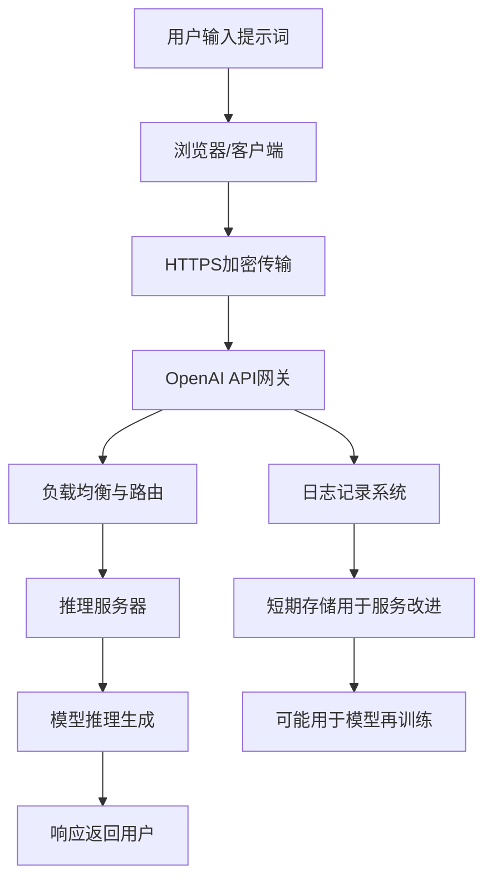

## 文章摘要

近期曝光的美国网络安全主管向ChatGPT泄露敏感政府文件事件，揭示了AI工具在企业与政府环境中使用的重大安全隐患。本文基于这一具体案例，深入剖析了大语言模型（LLM）在工作场景中的数据安全风险、合规挑战与技术伦理问题。文章不仅详细解析了事件的技术背景与深层原因，还提供了针对组织如何安全部署AI工具、制定有效数据治理政策的实用框架。通过技术原理分析、风险场景模拟和最佳实践建议，本文旨在帮助技术决策者、安全专家和开发者建立全面的AI安全认知，在享受AI生产力红利的同时，有效规避数据泄露与合规风险。

## 背景与问题

### 技术背景：大语言模型的普及与边界模糊化

自2022年ChatGPT横空出世以来，大语言模型（LLM）已从技术演示迅速演变为企业和政府机构的日常生产力工具。这些模型通过海量数据训练，展现出强大的文本生成、代码编写、数据分析与问题解决能力。然而，其交互模式——用户输入提示词（Prompt），模型返回生成内容——创造了一个看似无害但实则高风险的数据交换界面。

关键的技术现实是：**用户输入的数据可能被用于模型再训练或服务改进**。尽管OpenAI等提供商提供了企业版API（承诺数据不用于训练）和本地部署选项，但免费版或标准版ChatGPT的隐私政策通常允许数据被收集和分析。这种技术特性与用户认知之间的差距，构成了安全风险的温床。

### 问题场景：高权限角色的无意识数据泄露

本次事件的核心场景极具代表性：一位负责国家网络安全的高级官员，在处理日常工作时，将包含敏感政府信息的文件内容复制粘贴到ChatGPT的对话界面中，以寻求分析、总结或重写帮助。这种行为背后是典型的“生产力优先”思维——AI工具能显著提升工作效率，而安全考量往往在便利性面前被暂时搁置。

更值得深思的是，**泄露者本人就是网络安全领域的专家和领导者**。这凸显了一个严峻问题：即使是最了解安全风险的专业人士，在具体操作场景中也可能低估或忽视AI交互的数据安全边界。事件暴露的不仅是技术漏洞，更是组织流程、安全文化和员工培训体系的系统性缺失。

### 为什么这个问题至关重要？

1. **国家级安全风险**：政府敏感信息（如政策草案、内部通讯、安全协议）一旦泄露，可能被用于训练公开可访问的AI模型，间接导致国家机密在AI生成内容中“浮现”，或被恶意行为者通过提示词工程提取。

2. **企业合规危机**：对于企业而言，类似行为可能违反GDPR、CCPA、HIPAA等数据保护法规，导致巨额罚款、法律诉讼和声誉损失。客户数据、商业机密、知识产权通过AI工具泄露的案例已屡见不鲜。

3. **AI信任危机**：此类事件会加剧公众和组织对AI技术的不信任，阻碍技术创新和生产力提升的良性循环。建立安全、可信的AI使用环境已成为技术普及的关键前提。

4. **安全范式的转变**：传统的数据安全防护（防火墙、DLP、加密）主要针对外部攻击和内部恶意行为，但对“员工通过授权工具无意泄露”这类新型风险防护不足。安全策略需要从“防御恶意”扩展到“管理无意识风险”。

## 核心内容解析

### 3.1 核心观点提取

**观点一：AI工具的使用创造了全新的、难以监控的数据泄露渠道**
传统的数据泄露防护（DLP）系统主要监控电子邮件、USB传输、云存储上传等渠道。而员工与AI模型的交互——通过浏览器或API——往往绕过这些监控机制。对话式界面让数据泄露行为变得“自然”且难以被传统安全工具检测。

**观点二：安全专业知识不等于安全操作实践**
本次事件最讽刺之处在于，泄露者正是网络安全领域的负责人。这证明知识（了解风险）与行为（安全操作）之间存在巨大鸿沟。在追求效率的压力下，即使专家也会选择“捷径”。组织需要将安全从“知识层面”推进到“行为习惯层面”。

**观点三：免费/公开AI服务的隐私风险被系统性低估**
许多用户（包括技术人员）错误地认为“我只是在问问题”，而忽视了输入内容可能包含敏感信息。免费版ChatGPT等服务的隐私政策条款复杂，普通用户很少仔细阅读，更不了解其数据可能被用于模型改进，并在未来响应其他用户时被间接“回忆”。

**观点四：组织层面的AI治理政策严重滞后于技术采用速度**
大多数政府机构和企业在部署Microsoft 365、Slack等传统工具时都有严格的数据分类和处理政策，但对ChatGPT等新兴AI工具，往往缺乏明确的使用指南、技术控制和审计机制。这种政策真空是风险的主要来源。

**观点五：事件响应暴露了更深层的安全文化问题**
事件发生后，相关机构的处理方式和透明度受到质疑。这反映出组织在面对由高级官员造成的安全事件时，可能存在问责不明确、调查不彻底、整改不系统的问题。安全文化需要“自上而下”且“一视同仁”。

**观点六：技术解决方案（如本地部署）存在成本与能力的权衡**
虽然企业版API和本地模型部署能解决数据外流问题，但成本高昂（企业版API价格是标准版的数倍），且本地模型的能力通常弱于云端最新模型。组织需要在“安全”与“能力/成本”之间做出艰难权衡。

**观点七：AI助手的“拟人化”特性降低了用户的安全警惕性**
与传统的软件工具不同，ChatGPT等AI助手通过自然语言交互，创造了类似“与聪明同事对话”的体验。这种拟人化交互模糊了工具与人的边界，让用户在分享信息时更容易放松警惕，就像在向“可信赖的助手”倾诉，而非向一个可能记录一切的外部系统发送数据。

### 3.2 技术深度分析

#### 大语言模型的数据处理管道与风险点

要理解泄露风险，必须深入LLM的技术架构。当用户向ChatGPT（此处以OpenAI的GPT系列为例）发送提示词时，数据流经以下关键节点：



**风险点分析**：

1. **客户端风险**：浏览器扩展、恶意软件可能截获输入内容。员工设备若被入侵，所有AI交互均暴露。

2. **传输层风险**：虽然使用HTTPS，但中间人攻击（如果证书被破坏）或终端网络监控可能捕获数据。

3. **服务提供商风险（最关键）**：
   - **日志记录**：OpenAI明确声明会保留API数据最多30天，用于监控滥用。
   - **模型改进**：免费版和ChatGPT Plus用户的对话数据**默认**可能用于改进模型，除非用户主动关闭（设置中的“Data Controls”）。
   - **企业版差异**：通过Azure OpenAI Service或ChatGPT Enterprise API发送的数据，根据协议**不会用于模型训练**，且有更严格的加密和访问控制。

4. **模型记忆与提取风险**：LLM具有“记忆”训练数据中模式的能力。如果敏感信息被用于训练，理论上可能通过精心设计的提示词被“提取”出来，尽管提供商有防护机制。

#### 数据分类与AI交互的匹配矩阵

组织需要建立数据分类与AI工具使用的明确映射。以下是一个实用的风险评估矩阵：

| 数据敏感级别 | 描述示例 | 免费版ChatGPT | 企业API/本地部署 | 建议操作 |
|-------------|---------|--------------|-----------------|----------|
| **公开** | 公开新闻、技术文档 | 低风险 | 低风险 | 允许使用 |
| **内部一般** | 内部会议纪要（非机密） | 中等风险 | 低风险 | 需审批，建议使用企业版 |
| **机密** | 客户数据、商业计划 | **高风险** | 低风险 | **禁止使用免费版**，企业版需额外控制 |
| **高度机密** | 政府机密、个人医疗记录 | **极高风险** | 中等风险 | **严格禁止**，仅限隔离环境本地模型 |

#### 技术控制措施的实现细节

对于决定部署AI工具的组织，以下技术控制至关重要：

1. **网络层控制**：
   ```nginx
   # 示例：通过代理服务器阻止对公开AI服务的访问
   location /v1/chat/completions {
       if ($http_referer ~* (openai|chatgpt)) {
           return 403 "Access to public AI services is blocked. Use approved enterprise endpoints.";
       }
   }
   ```

2. **端点安全与数据丢失防护（DLP）集成**：
   - 部署能够识别AI服务流量的下一代防火墙（NGFW）
   - 配置DLP规则，检测包含敏感数据模式（如社保号、信用卡号、特定关键词）的HTTP POST请求
   - 使用浏览器扩展或端点代理，在数据离开设备前进行内容扫描

3. **企业AI网关架构**：
   ```
   用户设备 → 企业AI网关（认证/授权/审计） → 安全通道 → 
   └─ 选项A：Azure OpenAI Service（企业协议）
   └─ 选项B：本地部署的Llama/Mistral模型
   └─ 选项C：批准的第三方AI服务（通过API密钥管理）
   ```
   网关负责：用户身份验证、提示词内容审查（基于数据分类）、响应内容过滤（防止敏感信息泄露）、完整审计日志。

### 3.3 实践应用场景

#### 政府机构：安全优先的AI辅助决策

对于处理国家安全信息的机构，AI工具的使用必须遵循“零信任”原则：
- **环境隔离**：在物理隔离的网络中部署本地化大语言模型（如使用Llama 3、GPT-NeoX等开源模型）
- **数据脱敏管道**：开发自动化工具，在将文档提交给AI前，自动识别并替换敏感实体（人名、地点、代号）为占位符
- **双人原则**：敏感AI查询需两人共同授权，一人提交提示词，一人审核响应
- **审计追踪**：所有AI交互记录不可篡改的日志，包括原始提示词、模型响应、用户身份和时间戳

#### 企业环境：风险分级与可控创新

企业需要平衡创新需求与安全风险：
- **试点项目**：在低风险部门（如市场部撰写公开内容）试点AI工具，建立使用流程和评估框架
- **技术沙箱**：为研发团队提供安全的AI实验环境，包含模拟数据和真实模型的组合
- **员工培训场景**：
  ```
  错误示范：“请分析这份包含客户个人信息的Excel表格，找出购买模式”
  正确示范：“请分析这份已脱敏的销售数据样本（列：ProductID, SaleDate, Region），提供分析模式的方法论，我将自行应用于实际数据”
  ```
- **供应商管理**：将AI服务提供商的安全合规性纳入供应商风险评估，要求提供SOC 2 Type II、ISO 27001等认证。

#### 开发团队：安全AI应用开发

对于开发集成AI功能的应用团队：
- **最小权限API密钥**：使用范围受限的API密钥，避免在客户端代码中硬编码高权限密钥
- **输入验证与过滤**：服务端验证所有用户输入，防止提示词注入攻击
- **输出内容审查**：对AI生成内容进行安全扫描，防止生成恶意代码、偏见内容或泄露训练数据中的敏感信息
- **使用隐私保护技术**：探索联邦学习、差分隐私、同态加密等前沿技术，在保护数据隐私的同时利用AI能力。

## 深度分析与思考

### 4.1 文章价值与意义

本次事件报道的价值远超出单一新闻事件本身，它充当了行业“警钟”和“催化剂”的双重角色：

**对技术社区的价值**：事件迫使整个技术社区正视一个长期被忽视的问题——AI工具的便捷性与安全性之间的根本矛盾。它推动了从“如何更好使用AI”到“如何安全使用AI”的讨论转向。安全研究人员开始系统性地研究提示词中的数据泄露模式，开发检测工具；AI伦理社区则借此强调“负责任AI”不仅关乎输出内容，也关乎输入数据的处理。

**对行业的影响**：事件加速了企业AI安全市场的成熟。预计未来12-24个月内，我们将看到：
1. **专用AI安全工具**的涌现，专注于监控和防护AI交互中的数据流
2. **AI治理平台**的标准化，提供策略管理、风险评估和合规报告的一体化解决方案
3. **保险行业**开发针对AI相关数据泄露的专门险种
4. **监管框架**的快速演进，各国可能出台针对政府机构使用AI的强制性安全标准

**创新点与亮点**：事件揭示了安全领域的一个新范式——**无意识泄露（Unintentional Exposure）** 可能比恶意攻击造成更广泛的风险。因为攻击是定向的、有限的，而无意识泄露可能是普遍的、持续的。这要求安全策略从“防御坏人”扩展到“引导好人”，从纯技术控制扩展到行为心理学和组织文化设计。

### 4.2 对读者的实际应用价值

**对技术决策者（CTO、CISO）**：
- **风险评估框架**：获得一个结构化的AI安全风险评估方法，可立即应用于组织环境
- **政策制定模板**：了解AI使用政策的关键要素，包括数据分类、工具审批、员工培训和审计要求
- **技术选型指南**：理解不同AI部署模式（SaaS、企业API、本地部署）的安全权衡，做出明智投资决策
- **供应商评估清单**：学习评估AI服务提供商安全能力的核心问题，如数据保留政策、加密标准、合规认证等

**对安全专业人员**：
- **威胁建模扩展**：将“AI交互数据泄露”纳入组织的威胁模型，识别关键资产和攻击路径
- **监控策略更新**：学习如何扩展现有安全监控（SIEM、DLP）以覆盖AI工具使用
- **事件响应预案**：制定针对AI相关数据泄露的专门响应流程，包括数据追溯、影响评估和通知义务
- **安全意识培训材料**：获得针对AI安全的培训内容思路，帮助员工建立“AI交互即数据传输”的思维模式

**对开发者与数据科学家**：
- **安全开发实践**：学习在集成AI功能时保护用户数据的技术模式，如数据脱敏、安全API调用和输出验证
- **隐私保护技术**：了解差分隐私、联邦学习等前沿技术如何应用于AI开发，平衡功能与隐私
- **合规性设计**：掌握“隐私设计（Privacy by Design）”原则在AI应用中的具体实现方法
- **开源工具生态**：熟悉当前可用的开源AI安全工具（如Microsoft的Prompt Flow、IBM的AI Fairness 360扩展）

### 4.3 可能的实践场景

**项目应用建议**：

1. **AI安全评估项目**（周期：2-4周）：
   - 第一步：盘点组织内所有AI工具使用情况（影子IT发现）
   - 第二步：对主要工具进行数据流分析和风险评估
   - 第三步：制定临时控制措施（如网络阻断、代理配置）
   - 第四步：设计长期治理框架和试点政策

2. **安全AI助手开发项目**（周期：1-3个月）：
   - 目标：为员工提供既安全又有用的AI辅助工具
   - 架构：企业AI网关 + 批准的模型后端（如Azure OpenAI）
   - 功能：内置数据脱敏、内容审核、使用审计
   - 推广：与高风险部门合作试点，收集反馈迭代

3. **员工安全意识强化项目**（持续进行）：
   - 开发互动式培训模块，模拟AI数据泄露场景
   - 创建“AI安全快速参考卡”，列出“该做”和“不该做”
   - 定期发送安全提示，关注最新AI风险案例
   - 设立“AI安全冠军”计划，在每个部门培养专家

**学习路径建议**：

1. **基础理解**（1-2周）：
   - 学习大语言模型基本原理（Transformer架构、训练过程）
   - 理解主要AI服务提供商（OpenAI、Anthropic、Google）的隐私政策差异
   - 掌握数据分类和敏感信息识别的基本方法

2. **技术深度**（1-2个月）：
   - 研究企业AI部署架构模式（SaaS、PaaS、本地）
   - 学习API安全最佳实践（认证、授权、限流、监控）
   - 探索隐私增强技术（PETs）在AI中的应用

3. **治理与合规**（持续）：
   - 跟踪AI相关法规发展（欧盟AI法案、美国AI行政命令等）
   - 学习行业框架（NIST AI RMF、ISO/IEC 42001）
   - 参与专业社区（IAPP、RSA Conference AI安全专题）

### 4.4 个人观点与思考

**批判性思考**：当前对AI安全的讨论存在一个危险倾向——过度强调技术控制，而忽视行为和文化因素。技术措施（如DLP、网关）是必要的，但非充分的。如果员工将AI视为阻碍效率的“障碍”，他们会寻找规避方法（如使用个人设备访问公开AI服务）。真正的解决方案必须是**安全性与可用性的平衡**，让安全工具本身成为生产力助推器而非减速带。

**未来展望**：我认为未来3-5年将出现以下趋势：
1. **AI原生安全架构**：安全控制将深度集成到AI开发框架和运行时中，而非事后附加
2. **自动化的数据风险评估**：AI工具将能实时分析用户输入，自动识别敏感内容并建议脱敏或阻止提交
3. **个人AI代理与组织策略的协调**：员工个人AI助手将与组织安全策略动态协调，在保护数据的同时最大化个人生产力
4. **零知识证明在AI中的应用**