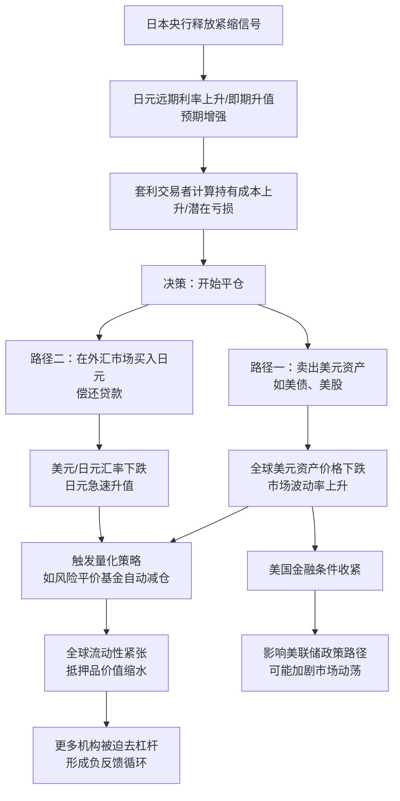

## 文章摘要

《The Great Unwind》一文聚焦于全球金融市场中一个潜在的系统性风险源：规模巨大的日元套利交易及其可能的平仓浪潮。文章核心观点指出，日本央行（BOJ）长期实施的超宽松货币政策（特别是收益率曲线控制YCC）催生了以近乎零成本借入日元、投资于全球高收益资产的套利交易。这种交易已成为全球流动性的重要基石。然而，随着日本通胀抬头和货币政策正常化的压力增大，一旦日元利率开始显著上升，将触发套利交易者大规模平仓，导致数万亿美元的资金从全球市场（尤其是美股、美债、新兴市场）急速回流日本。这个过程将引发全球资产价格重估、流动性紧缩和金融市场剧烈波动，其影响可能远超单一市场调整，构成一次“伟大的平仓”。文章的价值在于为读者提供了一个理解全球金融体系深层脆弱性的宏观框架，揭示了看似遥远的货币政策如何通过复杂的金融链条影响每一个市场参与者。

## 背景与问题

### 技术背景：套利交易与全球流动性引擎
在金融工程领域，“套利交易”是一种经典策略，其核心是“借入低利率货币，投资于高利率货币或高收益资产”，赚取息差和潜在的资本利得。自上世纪90年代末日本陷入通缩并实施零利率政策以来，日元成为了全球套利交易者最理想的融资货币。这一现象在2008年全球金融危机后因全球主要央行量化宽松而进一步深化。从技术角度看，这不仅仅是一个外汇策略，它已经演变成一个庞大的、系统性的“流动性生成机制”。全球的对冲基金、银行、保险公司乃至企业财务部门都参与其中，将借来的日元兑换成美元、欧元或其他货币，进而购买美国国债、科技股、公司债乃至新兴市场资产。这个链条将日本的流动性输送到全球，压低了全球的借贷成本，推高了风险资产价格。

### 问题场景：货币政策转向的连锁反应
当前的问题场景源于一个根本性的转变：日本持续数十年的通缩环境可能已经结束。2022年以来，全球通胀压力也波及日本，其消费者价格指数（CPI）持续超过日本央行2%的目标。这迫使市场开始严肃预期日本央行将逐步退出超宽松货币政策，包括放弃收益率曲线控制（YCC）和结束负利率政策。一旦日本短期利率从负值或零值开始上升，套利交易的核心前提——极低的融资成本——就将被动摇。交易者将面临两方面压力：一是持有日元空头头寸的利息成本增加；二是预期日元升值带来的汇率损失风险。这将触发他们反向操作：卖出全球资产，换回日元，偿还贷款。这个过程就是所谓的“平仓”或“解除”。

### 为什么重要：系统性风险的传导
这个问题之所以至关重要，是因为它触及了现代全球金融体系的“阿喀琉斯之踵”。日元套利交易的规模估计在数万亿美元级别，其平仓不是孤立事件，而是一个强烈的“风险传染”过程。首先，它会直接冲击外汇市场，导致日元急剧升值（其他货币相对贬值）。其次，为平仓而进行的大规模资产抛售会冲击全球债券和股票市场，导致价格下跌和波动率飙升。第三，也是最关键的一点，它会抽走全球金融体系的美元流动性（因为平仓需要卖出美元资产换取日元），可能引发类似于2019年9月或2020年3月的“美元荒”，导致融资市场紧张，甚至危及金融机构的稳定性。对于开发者、创业者和投资者而言，理解这一机制有助于洞察宏观风险，在资产配置、风险管理和产品设计（如涉及跨境业务或金融数据产品）时提前规避或应对潜在冲击。

## 核心内容解析

### 3.1 核心观点提取

1.  **日元套利交易是全球流动性的关键支柱**：文章指出，日元作为廉价融资货币的角色并非边缘现象，而是支撑过去二十年全球资产牛市的核心结构性因素之一。它像一条暗河，源源不断地将日本国内的过剩储蓄转化为全球投资资本。

2.  **货币政策正常化将触发强制性平仓**：日本央行任何收紧货币政策的信号或行动，都将直接提高套利交易的资金成本。这不是基于利润考量的主动选择，而是基于风险管理和止损的“强制性”平仓。这种平仓具有突然性和集体性，容易引发踩踏。

3.  **平仓过程具有非线性放大效应**：文章强调，平仓的影响不是简单的算术相加。初始的资产抛售会导致价格下跌，引发采用风险平价、波动率目标等量化策略的基金进行程序化抛售。同时，资产价格下跌会侵蚀其他投资者的抵押品价值，迫使更多人去杠杆，形成“下跌-抛售-再下跌”的恶性循环。

4.  **风险将首先在外汇和利率市场显现，但最终冲击所有风险资产**：冲击波的第一站是美元/日元汇率和日本国债利率。但很快会传导至美国国债市场（作为主要的投资标的），然后蔓延至全球股市、公司债和新兴市场。没有哪个市场能完全免疫。

5.  **这是一次对扭曲的全球货币体系的压力测试**：文章隐含的观点是，日元套利交易的积聚本身就是全球货币政策分化、长期利率人为压低的结果。“伟大的平仓”实质上是对这种扭曲状态的一次强制性修正，过程将是痛苦但必要的。

### 3.2 技术深度分析

要理解“伟大的平仓”的技术机制，我们需要拆解套利交易的头寸构成和平仓路径。

**技术原理与头寸构成**：
一个典型的日元套利交易者（例如一家美国对冲基金）的头寸包含以下环节：
1.  **融资端**：在日本货币市场以接近0%的利率借入日元。
2.  **外汇端**：立即在现货外汇市场卖出日元，买入美元（或其他货币）。这建立了一个“日元空头/美元多头”的外汇头寸。
3.  **投资端**：将兑换来的美元投资于美国10年期国债（收益率~4%）、标普500指数ETF或高收益公司债等资产。

这个组合的收益来源于：`美国资产收益率 - 日元融资利率 + 美元兑日元汇率变动`。只要日元利率极低且日元不升值，该策略就能稳定获利。

**平仓的技术路径分析**：
当日本央行加息预期升温时，平仓的连锁反应如下：

**技术对比：与2013年“削减恐慌”的异同**：
2013年，时任美联储主席伯南克暗示将缩减QE，引发了全球债市抛售（“削减恐慌”）。这与本次潜在风险有相似之处：都是央行政策转向引发全球流动性重估。但关键区别在于：
*   **源头货币不同**：“削减恐慌”源于作为全球储备货币的美元流动性收紧预期；而本次风险源于作为最大融资货币的日元成本上升。前者直接影响全球的“货币水龙头”，后者则影响一个巨大的“杠杆放大器”。
*   **头寸方向不同**：当时市场普遍做空美债（预期利率上升），而日元套利交易者则是做多全球资产。平仓意味着同时抛售多种资产，冲击面可能更广。
*   **市场环境不同**：当前全球债务水平更高，资产估值也更高，金融体系对流动性的依赖更强，因此可能更加脆弱。

### 3.3 实践应用场景

**对于量化开发与金融科技从业者**：
1.  **风险模型升级**：在开发投资组合风险管理系统或交易算法时，必须将“融资货币风险”作为一个独立且重要的风险因子纳入模型。不能只考虑资产本身的波动，还需考虑其资金来源的稳定性。例如，一个美股多头策略的回测，在假设融资成本恒定的情况下可能表现优异，但加入日元利率骤升的冲击场景后，夏普比率可能大幅恶化。
2.  **压力测试场景设计**：为机构客户设计风控系统时，应构建专门的“日元套利平仓”压力测试场景。关键参数包括：日元利率上升幅度、美元/日元汇率波动率、美债收益率跳升幅度以及各类资产间的相关性在危机中的变化（相关性趋近于1）。
3.  **数据产品需求**：可以开发监控相关指标的数据产品或仪表盘，例如：日本隔夜拆借利率、日元交叉货币基差互换、持有日元空头头寸的CFTC非商业持仓数据、外资对美债的买卖数据等，为交易员和基金经理提供早期预警。

**对于企业财务与战略规划者**：
1.  **外汇风险管理**：拥有日元负债或收入为美元/其他货币的企业，需要重新评估其外汇风险。日元升值在平仓期间可能是急速的，传统的对冲策略可能失效或成本极高。需考虑使用更灵活的期权策略或动态对冲。
2.  **融资策略审视**：依赖海外市场（尤其是日本市场）进行低成本融资的企业，需要预判融资成本上升的可能性，并提前开拓多元化的融资渠道。
3.  **投资与并购时机**：在潜在的市场动荡期，资产价格可能出现错杀。对于现金流充裕的企业，这可能是一个长期并购的机会。但同时，融资环境的收紧也可能使交易本身更难完成，需要做好预案。

## 深度分析与思考

### 4.1 文章价值与意义

《The Great Unwind》一文的价值远超一篇市场评论。它成功地将一个专业的外汇交易策略，提升到了理解全球金融体系结构性脆弱性的宏观框架高度。对于技术社区而言，其意义在于：

*   **提供了系统思维的案例**：文章完美展示了复杂系统中，一个局部参数（日本利率）的变化，如何通过金融网络（套利交易链条）传导并放大，最终影响整个系统（全球市场）的稳定性。这是系统论和网络理论在金融领域的鲜活例证，对构建分布式系统、理解互联网效应也有启发。
*   **揭示了“技术债务”的金融等价物**：在软件工程中，仓促实现的功能会积累“技术债务”，未来需要偿还。在金融领域，长期非常规货币政策催生的巨大套利交易规模，就是一种“金融债务”或“流动性债务”。文章指出，“偿还”这笔债务的过程（平仓）将是痛苦和混乱的。
*   **对算法交易和DeFi的警示**：当前市场充斥着由算法驱动的交易策略。在“伟大的平仓”这种非线性、跨资产类别的冲击中，这些算法的同质化反应可能加剧市场崩溃。同样，在去中心化金融（DeFi）领域，过度杠杆化的套利协议也可能在类似冲击下发生连环清算，值得协议设计者深思。

### 4.2 对读者的实际应用价值

1.  **技能提升：宏观分析与微观操作的结合**：读者可以学习如何将宏观主题（央行政策）转化为可交易的微观逻辑（具体资产的价格驱动因素）。这是一种高阶的金融分析能力。
2.  **问题解决：预判风险与寻找机会**：
    *   **风险规避**：持有大量风险资产且不了解其底层融资结构的投资者，可以借此重新审视自己的组合，避免成为平仓潮中的被动抛售者。
    *   **机会识别**：理解这一逻辑的交易者可以提前布局相关策略，例如：做多日元、做空对套利交易资金流入依赖度高的资产（如某些新兴市场股指）、或做多市场波动率（通过VIX相关产品）。
3.  **职业发展**：对于志在进入对冲基金、资产管理部门或金融科技公司的开发者而言，掌握这类宏观传导机制是区别于纯技术开发者的核心优势，有助于向量化研究员、策略师或产品经理等复合型角色发展。

### 4.3 可能的实践场景

1.  **项目应用：开发宏观风险预警系统**：
    *   **核心指标监控**：构建一个实时数据仪表盘，追踪日本通胀数据、BOJ会议纪要关键词情绪、日元利率衍生品（如TONAR OIS）、美元/日元汇率期权隐含波动率（风险逆转指标）等。
    *   **网络效应分析**：尝试使用图数据库来建模主要金融机构的跨境资产与负债头寸，模拟资金流动路径，识别脆弱环节。
    *   **压力测试引擎**：为小型资管机构或高净值客户开发一个轻量级的、包含“日元平仓”场景的投资组合压力测试工具。

2.  **学习路径**：
    *   **基础**：学习国际金融、中央银行学。
    *   **进阶**：研读关于套利交易、全球失衡（Global Imbalances）和金融危机的学术论文与经典书籍（如《这次不一样》）。
    *   **实践**：在模拟交易平台尝试构建和监控一个简单的“套利交易”模拟组合，观察其在各种新闻事件下的表现。

### 4.4 个人观点与思考

文章的论述极具说服力，但我认为有两点值得进一步探讨：

1.  **平仓的节奏与央行的应对**：市场普遍预期日本央行的政策正常化将是“缓慢而谨慎的”。这种预期本身可能延缓平仓的启动，但也会导致头寸进一步累积，最终增加“一次性出清”的风险。更可能的情景是“走走停停”的反复：每次BOJ行动引发市场动荡，迫使它暂停或放缓，形成拉锯战。这会导致市场在较长时间内处于高波动状态，而非一次性的崩盘。此外，全球主要央行（尤其是美联储）在感知到全球流动性紧张时，完全有可能通过货币互换协议或其他工具提供流动性，缓解冲击。这将是全球政策协调性的考验。

2.  **结构性变化可能削弱传统套利逻辑**：文章基于历史模式推演，但未来可能不同。如果全球主要经济体都进入高利率环境，日元与其他货币的息差收窄，套利交易的吸引力本身就会下降。此外，地缘政治风险加剧、去全球化趋势可能促使投资者更重视本土资产，削弱跨境套利的动力。因此，“伟大的平仓”可能以“缓慢泄漏”而非“决堤”的形式发生。

无论如何，这篇文章的核心警示是有效的：在一个高度金融化、杠杆化和互联化的世界里，忽略那些看似遥远、实则关键的宏观联系，是极其危险的。对于技术人而言，这提醒我们，在构建任何与金融相关的系统时，都必须将“黑天鹅”和“肥尾”事件纳入核心设计考量。

## 技术栈/工具清单

分析“伟大的平仓”这一主题，涉及从数据获取、处理到建模、可视化的全链条技术。以下是相关技术栈和工具：

*   **数据获取与处理**：
    *   **金融数据API**：Bloomberg Terminal, Refinitiv Eikon, **Quandl**, **Intrinio**, Alpha Vantage（提供免费基础数据）。对于日元相关数据，日本央行和财务省官网会发布权威数据。
    *   **网络爬虫**：`Python`的`BeautifulSoup`/`Scrapy`可用于抓取央行新闻稿、经济报告，进行文本情绪分析。
    *   **数据清洗与处理**：`Python`的`Pandas`, `NumPy`。

*   **分析与建模**：
    *   **统计分析**：`Python`的`Statsmodels`, `Scikit-learn`用于构建回归模型，分析变量间关系（如日元利率与美股波动率的关系）。
    *   **时间序列分析**：`ARCH`/`GARCH`模型（用于波动率建模），`Prophet`（Facebook开源的时间序列预测库）。
    *   **风险模型**：`PyPortfolioOpt`（投资组合优化），自定义的VaR（风险价值）和ES（预期短缺）计算模块。
    *   **网络分析**：使用`NetworkX`或`Neo4j`（图数据库）来尝试建模金融机构间的风险传导网络。

*   **可视化与仪表盘**：
    *   **Python可视化**：`Matplotlib`, `Seaborn`, `Plotly`（交互式图表）。
    *   **仪表盘**：`Grafana`（连接时序数据库如InfluxDB），`Plotly Dash` 或 `Streamlit`（快速构建Python Web应用）。

*   **回测与模拟**：
    *   **回测框架**：`Zipline`, `Backtrader`, 或基于`Pandas`自建简单回测引擎，用于测试基于“平仓”信号的交易策略。

## 相关资源与延伸阅读

1.  **原文链接**：[The Great Unwind - OccupyWallSt](https://occupywallst.com/yen) - 本文分析的起点，建议深入阅读。
2.  **官方数据源**：
    *   [日本央行 (BOJ) 统计数据](https://www.boj.or.jp/en/statistics/index.htm/)
    *   [美国商品期货交易委员会 (CFTC) 交易商持仓报告](https://www.cftc.gov/MarketReports/CommitmentsofTraders/index.htm) - 追踪日元期货头寸变化。
    *   [国际清算银行 (BIS) 季度报告](https://www.bis.org/publ/qtrpdf/r_qt2212.htm) - 经常有关于全球流动性和套利交易的深度分析。
3.  **经典文献与书籍**：
    *   《When the Bubble Bursts: Surviving the Canadian Real Estate Crash》 - 虽主题不同，但关于泡沫和杠杆