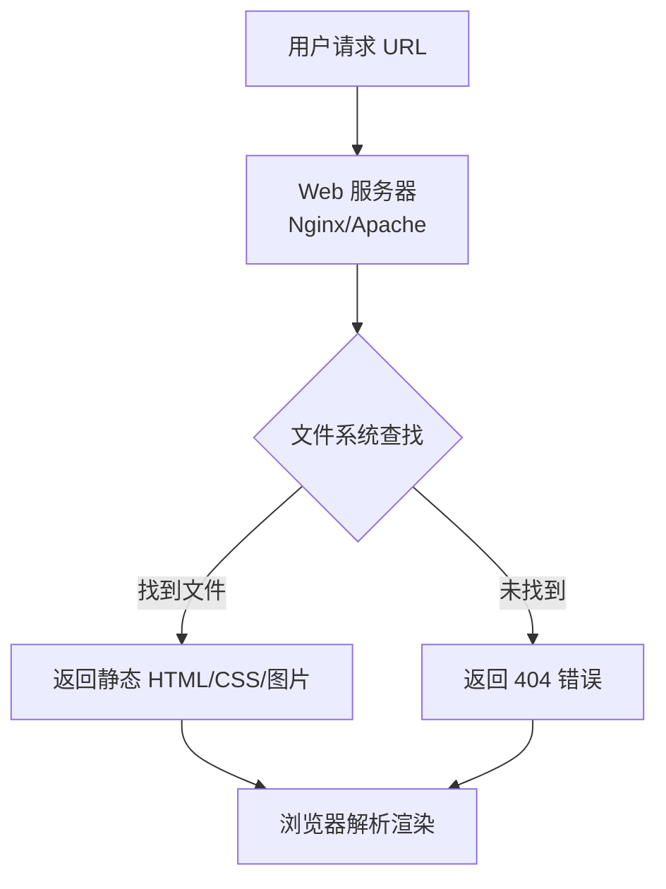

## 文章摘要

Sheldon Brown的自行车技术网站是一个互联网上的独特现象：一个由个人维护、纯粹使用HTML构建、内容深度无与伦比的静态知识库。本文的核心在于解析这个网站为何能超越其时代，成为技术文档、知识管理和个人品牌建设的典范。文章将探讨其背后的技术哲学——极简主义、持久性和可访问性，分析其信息架构如何将复杂的自行车机械知识转化为可操作指南，并思考在当今动态、框架驱动的Web开发世界中，这种“静态”方法所蕴含的永恒价值。对于开发者、技术写作者和内容创作者而言，这个案例提供了关于专注、深度和长期价值创造的深刻启示。

## 背景与问题

在Web 2.0、单页应用（SPA）和内容管理系统（CMS）主导的今天，我们习惯于网站的动态交互、实时更新和复杂的前端框架。然而，SheldonBrown.com 却是一个来自互联网早期时代的“活化石”，自上世纪90年代末上线以来，其核心形态——纯静态HTML页面——几乎未曾改变。网站创建者谢尔顿·布朗本人已于2008年去世，但这个网站不仅依然在线，而且被全球自行车爱好者、专业技师奉为“圣经”。

这引出了一个深刻的技术与内容策略问题：**在一个技术栈日新月异的时代，一个最简单的技术实现（静态HTML）如何能够承载并持续交付无与伦比的价值？** 更深层次的问题是，我们构建数字产品和知识库时，是应该追求技术的新颖与炫酷，还是应该像谢尔顿那样，追求内容的深度、准确性和极致的可访问性？

对于开发者社区而言，这个案例极具启发性。它挑战了“新技术必然更好”的假设，展示了“合适的技术”的力量。静态网站没有数据库，没有服务器端逻辑，没有JavaScript框架，但它做到了许多现代复杂系统难以企及的目标：**零维护开销（除托管外）、近乎无限的扩展性、完美的前向兼容性、极致的加载速度，以及抵御安全漏洞的天然韧性**。在DevOps、微服务和云原生架构大行其道的背景下，回顾这样一个极简主义的成功案例，能帮助我们重新思考软件工程的本质：我们究竟是在为用户解决问题，还是在为技术栈的复杂性所困？

## 核心内容解析

### 3.1 核心观点提取

- **观点标题：内容深度优先于形式炫技**
  - **详细说明**：谢尔顿的网站没有任何华丽的视觉效果或交互特效，其力量完全来源于海量、准确、极度细致的技术内容。从变速系统的毫米级调整到百年老车的零件规格，他用自己的专业知识构建了一个无可替代的权威知识库。
  - **重要性分析**：这提醒所有技术内容创作者，无论是个博客还是企业文档，核心价值在于信息的质量和独特性。精美的UI和流畅的交互是加分项，但无法替代扎实的内容。

- **观点标题：极简技术栈的永恒生命力**
  - **详细说明**：该网站由纯HTML文件组成，辅以少量CSS和图片。这种技术选择使其不受后端语言、数据库或框架版本淘汰的影响。只要HTTP协议和浏览器支持HTML，它就能被访问。
  - **重要性分析**：在技术债务成为普遍难题的今天，这种极简架构展示了如何构建几乎零技术债务的系统。对于文档、知识库等以内容为核心的项目，静态生成器（如Hugo、Jekyll）的复兴正是这一哲学的现代体现。

- **观点标题：清晰的信息架构胜过智能搜索**
  - **详细说明**：网站导航主要依靠一个精心设计的手工维护的索引页（`bikepro`）。虽然没有全文检索，但清晰的分类和直白的链接让用户能通过浏览快速定位。这种“可浏览性”本身就是一种强大的信息设计。
  - **重要性分析**：它证明了良好的信息组织（Information Architecture）是有效知识管理的基础。在过度依赖搜索框的时代，精心设计的结构化和层次化导航，能更好地帮助用户建立知识的心智模型。

- **观点标题：个人品牌与专业权威的深度融合**
  - **详细说明**：网站就是谢尔顿本人。他的观点、幽默感甚至个人骑行经历都融入在技术说明中。这种强烈的个人色彩没有削弱其权威性，反而因为透明和真实而增强了可信度。
  - **重要性分析**：对于技术专家和创作者而言，这展示了如何将个人知识、经验和热情产品化，建立一个以个人信用背书的、具有长期影响力的数字资产。

### 3.2 技术深度分析

从技术实现角度看，SheldonBrown.com 是一个“静态网站”的终极范例。我们来拆解其技术原理和选型考量：

**技术原理与工作机制**：
本质上，该网站就是存储在服务器上的一堆`.html`、`.css`、`.jpg`、`.gif`文件。当用户访问一个URL（如`/hubwidth.html`）时，Web服务器（如Apache或Nginx）只需找到对应的文件，并将其内容直接通过HTTP协议发送给用户的浏览器。浏览器接收到HTML后，解析并渲染页面，同时加载引用的CSS和图片。整个过程不涉及任何服务器端的数据库查询、模板渲染或业务逻辑计算。

**技术选型与优缺点分析**：
- **为什么选择纯静态HTML？**
  1.  **时代背景**：90年代末，动态网页技术（如PHP、ASP）刚起步，静态HTML是主流且最稳定的选择。
  2.  **个人工作流**：谢尔顿可以直接用文本编辑器编写HTML，完全控制内容的每一个细节，无需学习复杂的CMS。
  3.  **托管简单**：任何支持HTTP的服务器都能托管，成本极低，可靠性极高。
  4.  **性能极致**：没有比直接发送文件更快的Web服务方式了。

- **优点**：
  - **无与伦比的性能与可靠性**：响应时间仅受网络和磁盘I/O限制。
  - **极致的安全**：没有数据库注入、没有后端漏洞，攻击面极小。
  - **零维护**：无需升级PHP版本、打数据库补丁或更新框架。
  - **永久兼容**：HTML是最具前向兼容性的Web标准。
  - **可移植性**：整个网站可以打包为一个文件夹，在任何地方复制、备份、镜像。

- **缺点（及谢尔顿的应对）**：
  - **内容更新繁琐**：每篇文章都是独立文件，更新通用元素（如导航栏）需要手动修改每个文件。谢尔顿通过保持设计极度简单，最小化了通用元素的需求。
  - **缺乏动态功能**：无法实现评论、用户登录、实时搜索。谢尔顿通过提供电子邮件联系方式和精心设计的手动索引来弥补。
  - **可扩展性挑战**：当页面数量巨大时，手动管理链接和结构变得困难。网站通过扁平化和清晰的目录结构来缓解。

**与现代静态站点生成器（SSG）的对比**：
谢尔顿的方法是“手工编译”。现代SSG（如Hugo）则是“自动化编译”。开发者用Markdown写内容，用模板定义布局，SSG在构建时将这些“原料”批量生成最终的静态HTML文件。这继承了静态网站的所有优点，同时通过模板和部分（partial）解决了内容重复和站点范围更新的难题。可以说，SSG是将谢尔顿的哲学与现代化工具结合的产物。

### 3.3 实践应用场景

- **适用场景**：
  1.  **技术文档与知识库**：任何需要长期维护、以阅读为主、变更频率不高的文档，如API文档、产品手册、内部Wiki。
  2.  **个人博客与作品集**：专注于内容创作，不希望被平台算法或技术维护打扰的创作者。
  3.  **营销落地页**：产品介绍、活动宣传页等，对加载速度和稳定性要求极高的场景。
  4.  **归档项目**：将过时的动态网站（如旧版博客）转换为静态存档，以确保其永久可访问。

- **实际案例**：
  - **开源项目文档**：许多大型开源项目（如Kubernetes、React）使用类似Hugo的SSG生成其官方文档站点，确保全球开发者能快速、稳定地访问。
  - **政府与学术出版物**：需要长期保存、内容权威且不容篡改的官方文件，静态网站是理想载体。
  - **危机信息页面**：在自然灾害等网络条件差的情况下，一个极简的静态页面能最可靠地传递关键信息。

- **最佳实践**：
  1.  **内容与形式分离**：用Markdown等纯文本格式写作，用SSG管理样式和布局。
  2.  **版本控制一切**：将整个网站源码（内容、模板、配置）纳入Git管理，实现完整的版本历史和协作。
  3.  **自动化部署**：通过CI/CD（如GitHub Actions）实现“提交即发布”，将生成的静态文件自动部署到CDN或对象存储。
  4.  **拥抱CDN**：利用Cloudflare、Netlify、Vercel等服务，将静态资源分发到全球边缘节点，获得极致的访问速度和高可用性。

## 深度分析与思考

### 4.1 文章价值与意义

SheldonBrown.com 的价值远超一个自行车维修指南。它对技术社区的贡献在于提供了一个**反主流但极其成功的工程范式案例**。在追求“全栈”、“实时”、“响应式”的喧嚣中，它安静地证明了“简单、专注、持久”的力量。它影响了整整一代Web开发者重新审视静态网站的价值，间接推动了JAMstack架构和现代静态站点生成器的流行。

对行业而言，它树立了**专业数字知识库的标杆**。它展示了如何不依赖平台、不追逐流量，仅凭专业深度和无私奉献，就能构建一个具有全球影响力和永恒价值的资产。在知识付费和平台垄断的今天，这种独立、开放、非营利的知识共享模式，显得尤为珍贵和具有启发性。

其创新点在于**将个人化的深度内容与极简的通用技术完美结合**。谢尔顿没有发明新技术，但他以惊人的毅力和热情，在一个狭窄的领域（自行车技术）挖了一口极深的井，并用最通用的容器（HTML）来盛放它，确保了这口井能被所有人、在所有时间饮用。

### 4.2 对读者的实际应用价值

对于**开发者**，这个案例是一次关于技术选型的深刻教育。它教会我们根据项目的核心需求（持久的内容交付）而非技术潮流来选择栈。你能学到如何评估技术债务，如何设计可维护性极高的系统架构，以及如何将复杂内容通过简单的技术呈现。

对于**技术写作者和内容创作者**，谢尔顿是大师级的榜样。你能学到如何组织复杂信息，如何用平实的语言解释艰深的概念，以及如何通过持续的、高质量的输出来建立不可动摇的权威。更重要的是，你能看到将个人知识系统化、产品化的完整路径。

对于**创业者或产品经理**，这个网站展示了** niche 市场的巨大潜力**。在一个垂直领域做到极致，即使受众相对较小，也能创造出巨大的价值和忠诚的社区。它证明了深度和专注是比广度更有效的竞争策略。

### 4.3 可能的实践场景

- **项目应用**：
  1.  启动一个**个人学习笔记博客**，使用Hugo等SSG，将学习过程公开化、系统化，逐步构建自己的知识数字花园。
  2.  为团队**重构陈旧的企业Wiki**，将内容从复杂的Confluence或MediaWiki中导出，用SSG生成一个更快速、更易维护的静态内部知识站点。
  3.  创建**开源项目的专项问题解决指南**，例如“React性能优化宝典”或“K8s网络排错手册”，采用类似谢尔顿的深度案例解析风格。

- **学习路径**：
  1.  **基础**：学习HTML/CSS核心原理，理解HTTP协议。
  2.  **工具**：掌握一个现代SSG（推荐Hugo或Eleventy），学习Markdown和模板语法。
  3.  **实践**：选择一个你熟悉的专业领域，开始撰写深度文章，并部署到GitHub Pages或Netlify。
  4.  **进阶**：研究网站性能优化（图片、字体、缓存）、可访问性（ARIA）和SEO最佳实践，应用到你的静态站点中。

- **工具推荐**：
  - **SSG**: Hugo (Go, 速度快), Eleventy (JavaScript, 灵活), Jekyll (Ruby, 生态成熟)。
  - **部署**: Netlify, Vercel, GitHub Pages, Cloudflare Pages。
  - **编辑**: VS Code + 相关插件， Typora。
  - **设计**: 使用成熟的SSG主题起步，如Hugo的Academic主题或Eleventy的Base主题。

### 4.4 个人观点与思考

谢尔顿的网站让我思考技术的“进步”究竟意味着什么。我们拥有了React、Vue、GraphQL，但很多时候我们只是在用更复杂的方式解决由复杂框架自身引入的问题。而谢尔顿用一把“HTML锤子”，敲出了一座知识宫殿。这并非否定现代Web技术，而是提醒我们**技术的复杂性应该与待解决问题的复杂性相匹配**。

未来，我认为“动态内容静态化”和“边缘计算”的结合将是趋势。像Next.js的增量静态再生（ISR）或Astro的岛屿架构（Islands Architecture），都是在试图融合静态的可靠性能与动态的交互需求。但它们的核心精神，与谢尔顿的哲学一脉相承：**尽可能多地在构建时（build time）完成工作，将简单、稳定的静态资源交付给用户。**

一个潜在的注意点是，纯静态网站对**社区互动和内容更新**的支持天生不足。谢尔顿通过个人邮件和社区口碑来弥补。现代项目可以引入轻量级动态组件，如通过API调用加载的评论系统（如Utterances）、搜索功能（如Algolia），或通过Webhook触发重新构建来实现“准动态”更新。关键在于，这些动态部分是隔离的、可降级的附加功能，不影响核心内容的稳定交付。

## 技术栈/工具清单

SheldonBrown.com 的核心技术栈是互联网的基石，简单到令人肃然起敬：

- **核心语言/标准**:
  - **HTML 4.01 / XHTML 1.0**: 用于内容结构和语义标记。
  - **CSS 1/2**: 用于极简的样式控制，实现基本的布局和字体渲染。
  - **HTTP/1.1**: 内容传输协议。

- **文件格式**:
  - `.html`: 主内容文件。
  - `.css`: 样式表。
  - `.jpg`/`.gif`: 图片资源，用于图表、插图和照片。

- **隐含的工具链**:
  - **文本编辑器**: 推测为早期如Notepad或BBEdit等工具，用于手工编写HTML。
  - **FTP客户端**: 用于将文件上传到托管服务器。
  - **基本的图片处理工具**: 用于创建和优化技术图解。

- **现代等效技术栈（实现相同哲学）**:
  - **静态站点生成器 (SSG)**: Hugo (Go), Jekyll (Ruby), Eleventy (JavaScript), Gatsby (React/GraphQL)。
  - **版本控制**: Git, GitHub/GitLab。
  - **部署平台**: Netlify, Vercel, GitHub Pages, Cloudflare Pages。
  - **前端框架 (可选)**: 用于增强交互性，如React, Vue，但通常与SSG结合使用（如Next.js, Nuxt.js）。
  - **CSS框架 (可选)**: Tailwind CSS, Bootstrap，用于快速构建一致UI。

**学习资源**:
- **MDN Web Docs**: 学习HTML、CSS、HTTP的权威来源。
- **Hugo 官方文档**: 快速上手现代静态网站生成。
- **JAMstack 官网**: 了解现代静态架构的最佳实践和案例。

## 相关资源与延伸阅读

- **原文链接（核心分析对象）**: [Sheldon Brown's Bicycle Technical Info](https://www.sheldonbrown.com/)
- **网站镜像与维护**: 谢尔顿去世后，其网站由哈里斯自行车公司（Harris Cyclery）和众多志愿者维护，确保了知识的延续。访问时请注意，部分外部链接可能已失效。
- **现代静态网站哲学**:
  - [JAMstack.org](https://jamstack.org/): 现代静态架构的官方站点，包含理念、案例和资源。
  - [关于数字花园](https://maggieappleton.com/garden-history): Maggie Appleton 对数字花园（一种深度、互联的个人知识库）的精彩论述，与谢尔顿的网站精神相通。
- **经典技术文档典范**:
  - [PHP 官方手册](https://www.php.net/manual/en/): 另一个以内容深度和社区维护著称的优秀技术文档案例。
  - [RFC 文档](https://datatracker.ietf.org/doc/html/): 互联网的技术基石，纯文本格式，永恒价值。
- **工具与社区**:
  - [Hugo 论坛](https://discourse.gohugo.io/): 活跃的社区，讨论静态网站构建。
  - [Netlify 博客](https://www.netlify.com/blog/): 大量关于现代Web开发、JAMstack和最佳实践的文章。

## 总结

Sheldon Brown的自行车技术网站是一个来自互联网黄金时代的礼物，它用最朴素的技术语言，讲述了一个关于深度、专注和永恒的动人故事。它向我们证明，**真正的技术力量不在于堆砌框架和工具，而在于用最合适的方式，解决真实世界的问题，并创造持久的价值**。

作为开发者和创作者，我们应当从中汲取两个关键收获：第一，在技术选型