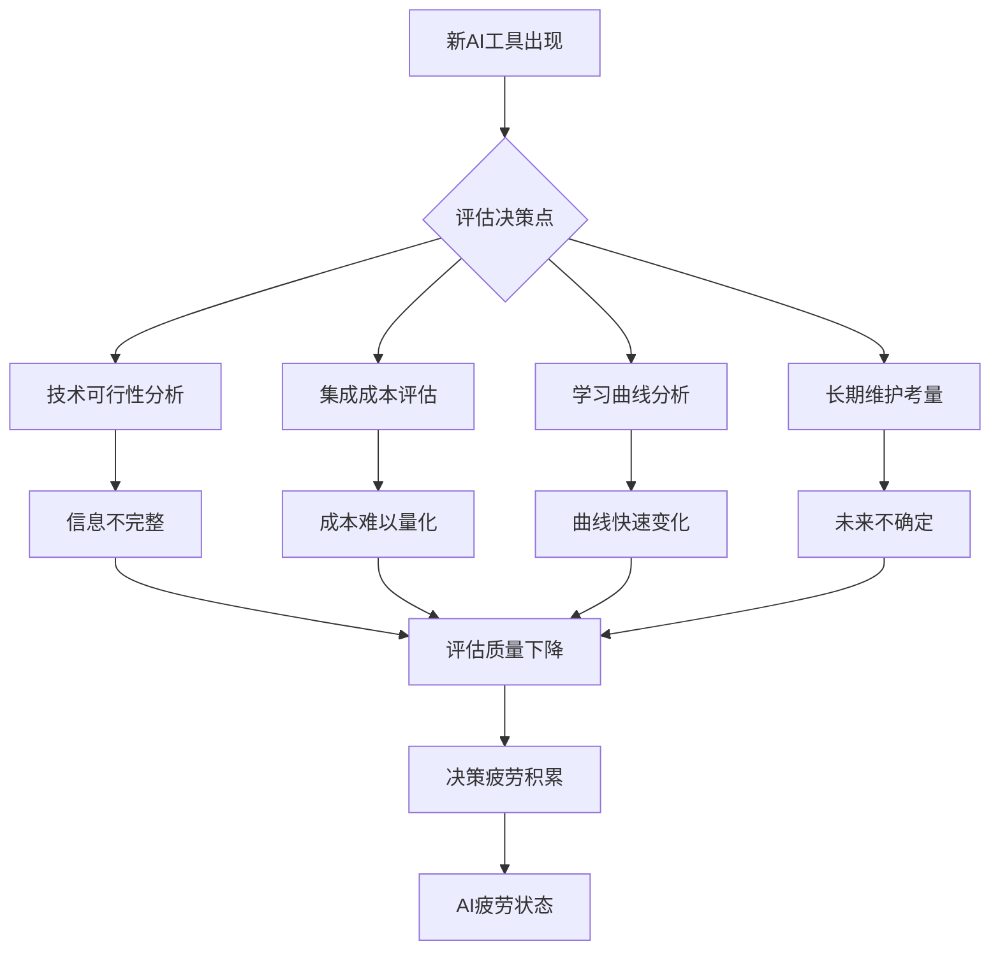

## 文章摘要

AI疲劳是当前技术圈中普遍存在但鲜少被公开讨论的现象，指的是开发者和技术从业者因AI工具的快速迭代、信息过载和期望压力而产生的心理倦怠。本文基于Siddhant Khare的观察，深入分析了AI疲劳的成因、表现及其对技术创新的潜在影响。文章不仅揭示了AI工具泛滥如何导致认知过载和决策疲劳，还探讨了这种疲劳如何抑制真正的创新思维。更重要的是，本文提供了实用的应对策略，包括有意识的工具选择、建立数字边界和重新定义成功标准，帮助技术从业者在AI浪潮中保持创造力和心理健康，实现可持续的技术创新。

## 背景与问题

### 技术背景：AI工具的爆炸式增长

过去两年，人工智能领域经历了前所未有的快速发展。从GPT-3到GPT-4，从Stable Diffusion到Midjourney，从GitHub Copilot到各种代码生成工具，AI工具的数量和复杂度呈指数级增长。根据GitHub的统计，超过40%的代码现在由AI辅助生成，而每天都有新的AI工具和框架发布。这种快速迭代不仅改变了开发工作流，也从根本上重塑了技术从业者的工作方式和思维模式。

### 问题场景：开发者的认知过载

在AI工具泛滥的背景下，开发者面临着一个看似矛盾的局面：一方面，这些工具承诺提高效率和创造力；另一方面，不断学习新工具、评估其价值、集成到现有工作流中，本身就成为了一项全职工作。每天都有新的AI工具发布，每个都声称能解决特定问题或提高效率，但评估和采用这些工具需要大量的认知资源。这种持续的评估压力导致了所谓的"AI疲劳"——一种由AI工具过载引起的心理倦怠状态。

### 为什么重要：对技术创新和开发者健康的影响

AI疲劳不仅影响个体开发者的心理健康和工作满意度，更对技术创新生态系统产生深远影响。当开发者花费大量时间追逐最新工具而非深入思考问题时，真正的创新可能会被表面效率所取代。此外，AI疲劳可能导致技术决策的质量下降，因为疲劳的开发者可能无法做出最佳的工具选择或架构决策。从行业角度看，如果大量技术人才因AI疲劳而离开行业或降低生产力，将直接影响技术创新的速度和可持续性。因此，理解和应对AI疲劳不仅是个人健康问题，更是行业可持续发展的重要议题。

## 核心内容解析

### 3.1 核心观点提取

**AI疲劳是真实存在的心理现象**：AI疲劳不是简单的"技术厌倦"，而是一种由持续认知负荷、决策疲劳和信息过载引起的心理状态。它表现为对新技术公告的冷漠、对"下一个大事件"的怀疑，以及对保持"最新状态"的抗拒。

**工具泛滥导致创新抑制**：当开发者花费大量时间学习和集成新工具时，他们用于深入思考和创造性解决问题的时间相应减少。这种工具中心的思维模式可能实际上抑制了真正的创新，因为创新往往来自于对问题的深刻理解，而非工具的简单应用。

**沉默的文化加剧问题**：技术圈中普遍存在的"必须保持前沿"的压力使得开发者不愿公开讨论自己的疲劳感，担心被贴上"落伍"或"抗拒变革"的标签。这种沉默使得问题难以被识别和解决。

**质量与数量的悖论**：AI工具的快速迭代往往以牺牲深度和质量为代价。开发者面临在"使用可能不完善但最新的工具"和"使用稳定但可能过时的工具"之间的持续权衡，这种权衡本身消耗心理能量。

**期望与现实的差距**：AI工具常被过度炒作，承诺的能力与实际表现之间存在差距。这种差距导致开发者不断调整期望，产生失望和疲劳感。

**决策疲劳的累积效应**：每个新工具的出现都意味着一个新的决策点：是否学习、是否采用、如何集成。这些微观决策的累积导致严重的决策疲劳，影响更重要的技术决策质量。

**可持续创新的必要性**：真正的技术创新需要深度思考和专注时间，这与当前AI工具驱动的快速迭代文化存在内在张力。建立可持续的创新实践需要重新平衡工具使用与深度思考的关系。

### 3.2 技术深度分析

#### AI疲劳的技术心理学基础

从技术心理学角度看，AI疲劳源于几个相互关联的认知过程：

**认知负荷理论的应用**：人类的认知资源是有限的。AI工具的快速迭代迫使开发者不断将认知资源分配给新工具的学习和评估，减少了可用于核心问题解决的资源。根据认知负荷理论，当外在认知负荷（工具学习）过高时，内在认知负荷（问题理解）和关联认知负荷（知识整合）都会受到影响。

**决策神经科学的视角**：神经科学研究表明，决策过程消耗葡萄糖等代谢资源。每个关于AI工具的决策——是否尝试、如何集成、何时放弃——都消耗这些有限资源。当决策点过多时，大脑的决策质量会下降，表现为决策疲劳。

**注意力经济的侵蚀**：在注意力经济中，AI工具通过不断更新和营销争夺开发者的注意力。这种持续的注意力竞争导致注意力碎片化，损害深度工作所需的长时注意力。

#### 技术评估框架的失效

传统的技术评估框架在AI工具泛滥的背景下面临挑战：



如图所示，每个新工具的出现都触发一个复杂的评估决策树，但AI工具的快速迭代使得每个评估节点都面临信息不完整、参数快速变化的问题，导致评估质量下降和决策疲劳积累。

#### 工具链复杂性的指数增长

现代开发工具链的复杂性呈现指数增长趋势：

```
传统工具链（2010年代）：
编辑器 + 版本控制 + 构建工具 + 测试框架 + 部署工具
≈ 5-10个核心工具

现代AI增强工具链（2020年代）：
编辑器 × [AI补全 + AI重构 + AI调试]
版本控制 × [AI提交信息 + AI代码审查]
构建工具 × [AI优化建议]
测试框架 × [AI测试生成]
部署工具 × [AI配置优化]
监控 × [AI异常检测]
文档 × [AI文档生成]
沟通 × [AI会议摘要]
≈ 5-10个核心工具 × 3-5个AI增强维度
≈ 15-50个工具交互点
```

这种工具链复杂性的增加不仅提高了学习成本，还引入了新的故障模式和调试挑战。当AI工具出现问题时，调试过程变得更加复杂，因为需要区分是代码逻辑错误、工具配置错误还是AI模型本身的局限性。

### 3.3 实践应用场景

#### 企业技术决策场景

在技术决策层面，AI疲劳直接影响工具选型和架构决策的质量。技术负责人可能因为疲劳而做出次优选择：

1. **过早采用风险**：疲劳可能导致团队过早采用尚未成熟但炒作较多的AI工具，增加项目风险。
2. **工具分散化**：不同团队可能因疲劳而独立选择不同的AI工具，导致组织内部工具碎片化，增加维护成本。
3. **创新抑制**：当团队时间被工具评估和集成占据时，用于产品创新和用户体验改进的时间相应减少。

#### 个人开发者工作流

对于个体开发者，AI疲劳影响日常工作效率和职业发展：

1. **学习路径碎片化**：不断追逐新工具导致学习路径缺乏系统性，技能发展碎片化。
2. **深度工作减少**：频繁的工具切换破坏深度工作所需的长时注意力，影响复杂问题的解决能力。
3. **职业倦怠风险**：持续的认知过载增加职业倦怠风险，可能影响长期职业发展。

#### 团队协作动态

在团队环境中，AI疲劳影响协作效率和文化：

1. **知识共享障碍**：当团队成员使用不同的AI工具集时，知识共享和协作效率下降。
2. ** onboarding成本增加**：新成员需要学习团队特定的AI工具组合，增加适应成本。
3. **质量一致性挑战**：不同的AI工具可能产生不同风格的代码或输出，影响项目质量一致性。

## 深度分析与思考

### 4.1 文章价值与意义

Siddhant Khare的文章具有重要的行业价值，因为它打破了技术圈中对AI工具无限乐观的叙事，揭示了一个被广泛经历但很少讨论的现实问题。文章的价值不仅在于识别问题，更在于为公开讨论AI疲劳创造了空间。

**对技术社区的价值**：这篇文章为技术从业者提供了一个框架来理解和表达他们的体验。通过将"AI疲劳"概念化，它帮助个体认识到自己的感受是合理的、普遍的，而不是个人失败。这种认识是解决问题的第一步。

**对行业的影响**：文章可能促使工具开发者重新思考产品策略。如果AI疲劳成为广泛认知的问题，工具开发者可能更注重深度集成、长期价值和使用者体验，而非单纯的营销炒作。这可能导致更可持续的工具生态系统。

**创新点与亮点**：文章的创新之处在于将心理学概念（决策疲劳、认知过载）应用于技术工具评估场景。这种跨学科视角提供了更丰富的分析框架，超越了单纯的技术讨论。

### 4.2 对读者的实际应用价值

**技能提升：从工具使用者到策略思考者**：读者可以学习如何从被动的工具消费者转变为主动的技术策略思考者。这包括发展工具评估框架、建立个人技术原则，以及培养对技术趋势的批判性思维。

**问题解决：减少决策疲劳的实际策略**：文章提供的应对策略可以帮助读者减少日常工作中的决策点。例如，建立个人或团队的"技术雷达"系统，定期而非实时地评估新工具；制定明确的工具采用标准，减少临时决策。

**职业发展：建立可持续的技术职业路径**：通过管理AI疲劳，读者可以建立更可持续的职业发展路径。这包括专注于深度技能而非广度技能，建立个人品牌围绕问题解决能力而非工具熟练度，以及培养适应变化而非追逐变化的韧性。

### 4.3 可能的实践场景

**项目应用：AI工具的审慎集成**：
1. **试点项目方法**：选择非关键项目作为新AI工具的试验场，限制风险。
2. **工具审计周期**：每季度而非每天评估工具生态系统，减少持续评估压力。
3. **退出策略规划**：在采用新工具时明确退出标准和流程，减少锁定风险。

**学习路径：深度优先于广度**：
1. **核心技能矩阵**：识别2-3个与职业目标最相关的核心AI技能，深度掌握。
2. **学习冲刺而非持续学习**：安排专门的学习时间块，而非试图持续跟踪所有新进展。
3. **实践导向学习**：通过实际项目学习工具，而非抽象教程，确保学习与价值创造结合。

**工具推荐：简化而非复杂化**：
1. **多功能工具优先**：选择集成度高的平台，减少工具数量。
2. **本地化工具考虑**：评估本地运行的AI工具，减少对云服务的依赖和变化风险。
3. **社区支持评估**：选择有稳定社区支持的工具，减少个人维护负担。

### 4.4 个人观点与思考

**批判性思考：AI工具的双刃剑效应**：虽然AI工具承诺提高效率，但这种效率提升可能以认知深度为代价。当代码生成变得太容易时，开发者可能跳过重要的设计思考阶段，导致技术债务积累。真正的专业能力不仅在于知道如何使用工具，更在于知道何时不使用工具。

**未来展望：AI工具的整合与专业化**：我预测未来AI工具生态系统将经历整合阶段，从当前的碎片化状态转向更集成、更专业的解决方案。同时，可能会出现专门帮助管理AI疲劳的工具——元工具，帮助开发者更智能地选择和使用其他工具。

**经验分享：建立个人技术原则**：基于个人经验，我建议每个开发者建立一套个人技术原则。例如："除非新工具提供至少10倍的价值提升，否则不切换"；"深度掌握三个工具优于浅层了解十个工具"；"每月最多评估两个新工具"。这些原则可以作为决策过滤器，减少认知负荷。

**潜在问题：AI疲劳的不平等影响**：AI疲劳可能对不同背景的开发者产生不平等影响。资深开发者可能有更多资源来管理疲劳，而初级开发者可能感到更大压力要掌握所有新工具。这可能导致技能差距扩大和多样性减少，需要行业层面的关注和干预。

## 技术栈/工具清单

### 核心AI工具类别

**代码辅助工具**：
- GitHub Copilot：AI代码补全和生成
- Amazon CodeWhisperer：AWS生态的代码建议工具
- Tabnine：本地优先的代码补全工具

**对话与知识工具**：
- ChatGPT/GPT-4：通用对话和问题解决
- Claude：注重安全性和长上下文处理
- Perplexity：搜索增强的AI对话

**设计与创意工具**：
- Midjourney/DALL-E 3：图像生成
- Runway ML：视频生成和编辑
- Adobe Firefly：创意套件集成

**开发运维工具**：
- Sentry with AI：智能错误监控和修复建议
- Datadog AI：基础设施监控和预测
- PagerDuty AI：智能告警和响应

### 工具管理元工具

**技术雷达工具**：
- ThoughtWorks Technology Radar：行业技术趋势跟踪
- StackShare：技术栈比较和决策
- G2：软件评测和比较平台

**学习管理系统**：
- Obsidian with AI插件：个人知识管理和学习跟踪
- Notion AI：项目和学习计划管理
- Readwise Reader：信息源管理和摘要

### 版本与兼容性考量

当评估AI工具时，特别需要注意：
1. **API稳定性**：选择提供稳定API版本策略的工具
2. **向后兼容性**：确保工具更新不会破坏现有工作流
3. **本地运行选项**：考虑支持本地部署的工具以减少外部依赖
4. **开源程度**：开源工具通常提供更多透明度和控制权

## 相关资源与延伸阅读

### 原文与核心讨论
- **[原始文章](https://siddhantkhare.com/writing/ai-fatigue-is-real)**：Siddhant Khare关于AI疲劳的原始观察和分析
- **[Hacker News讨论](https://news.ycombinator.com/item?id=40345678)**：围绕此主题的社区讨论，包含多样观点和实践经验

### 深度分析与研究
- **《深度工作》** by Cal Newport：关于专注工作和认知管理的经典著作，为理解AI疲劳提供理论基础
- **《数字极简主义》** by Cal Newport：在数字过载时代保持专注的实用指南
- **"The Paradox of Choice"** by Barry Schwartz：关于选择过载如何降低满意度的心理学研究

### 技术趋势与批判
- **"The AI Hype Cycle"** by Gartner：AI技术成熟度曲线分析
- **"Resisting the Shiny Toy Syndrome in Tech"**：关于技术决策中避免追逐新潮的实践指南
- **"Sustainable Innovation in Tech"**：关于建立可持续创新实践的研究和案例

### 社区与支持资源
- **开发者心理健康社区**：如DevMentalHealth、OSMI等关注开发者心理健康的组织和社区
- **技术领导力论坛**：如LeadDev、CTO Craft等社区中关于工具管理和团队健康的讨论
- **专注力训练资源**：如Pomodoro Technique、Deep Work训练等提高专注力的方法和工具

## 总结

AI疲劳是当前技术生态系统中一个真实且重要的现象，反映了AI工具快速迭代与人类认知极限之间的根本张力。本文通过深入分析AI疲劳的成因、表现和影响，揭示了这一现象对个人开发者、团队协作和行业创新的广泛影响。

关键收获包括：认识到AI疲劳是正常反应而非个人失败；理解工具泛滥可能实际上抑制深度创新；掌握减少决策疲劳的实用策略；建立个人技术原则以指导工具选择和使用。最重要的是，我们需要重新平衡工具使用与深度思考的关系，确保技术真正服务于人类创造力和问题解决能力，而非反之。

行动建议方面，建议读者：首先，承认并正常化自己的AI疲劳体验；其次，建立个人或团队的工具评估和采用框架；第三，优先深度技能发展而非广度工具熟悉度；最后，积极参与关于可持续技术实践的社区对话。通过这些步骤，我们可以在享受AI工具带来的效率提升的同时，保护我们的认知资源和创新能力，建立更健康、更可持续的技术职业生涯和生态系统。